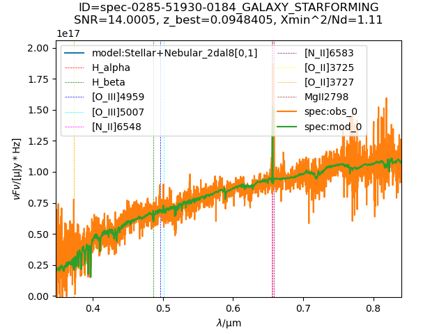
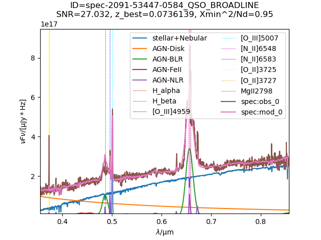
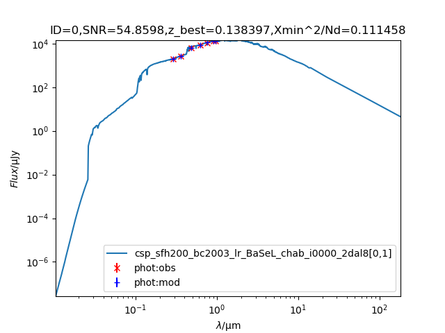
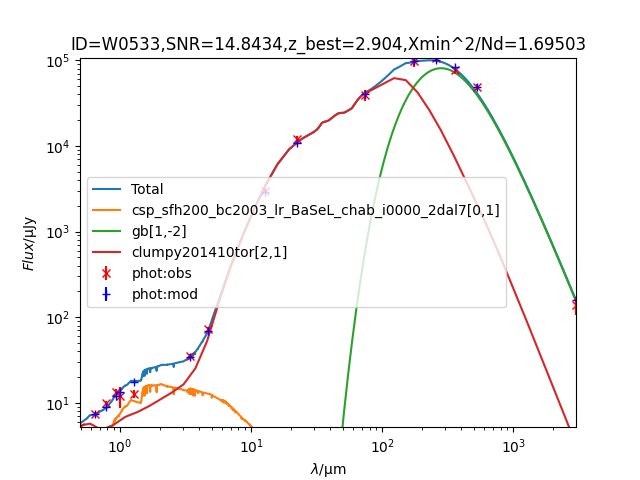
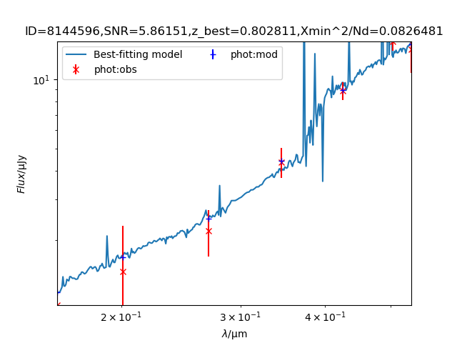
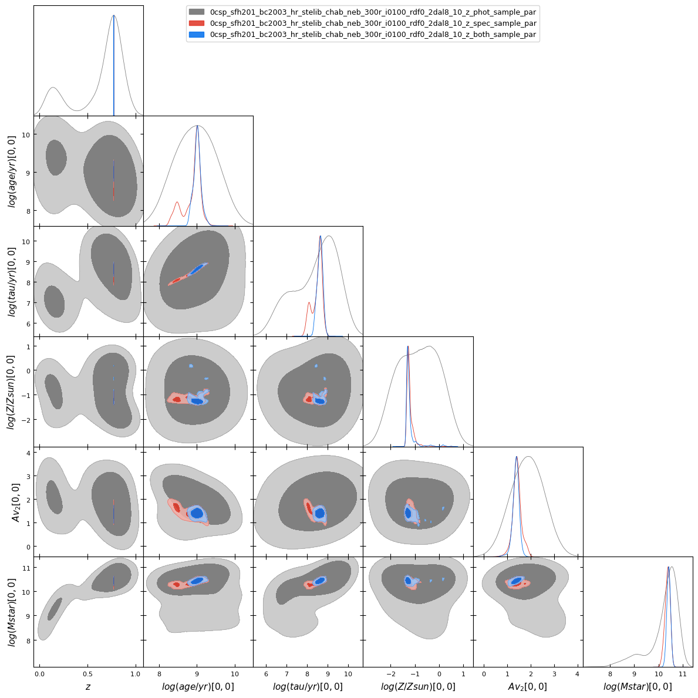

# BayeSED3: A code for Bayesian SED synthesis and analysis of galaxies and AGNs

<p align="center">
  
  <br>
  <em>"With four parameters I can fit an elephant, and with five I can make him wiggle his trunk."</em>
  <br>
  <small>- Attributed to John von Neumann</small>
</p>

BayeSED3 is a general and sophisticated tool for the full Bayesian interpretation of spectral energy distributions (SEDs) of galaxies and AGNs. It performs Bayesian parameter estimation using posteriori probability distributions (PDFs) and Bayesian SED model comparison using Bayesian evidence. BayeSED3 supports various built-in SED models and can emulate other SED models using machine learning techniques.

## Key Features

- **Explore the [BayeSED3-AI Assistant 🚀](https://udify.app/chat/Gmni8M7sHDKWG67F) or [](https://deepwiki.com/hanyk/BayeSED3) for interactive help and guidance!**
- Multi-component SED synthesis and analysis of galaxies and AGNs
- Flexible stellar population synthesis modeling
- Flexible dust attenuation and emission modeling
- Flexible stellar and gas kinematics modeling
- Non-parametric and parametric star formation history options
- Comprehensive AGN component modeling (Accretion disk, BLR, NLR, Torus)
- Intergalactic medium (IGM) absorption modeling
- Handling of both photometric and spectroscopic data
- Bayesian parameter estimation and model comparison
- Machine learning techniques for SED model emulation
- Parallel processing support for improved performance
- User-friendly CLI, Python script and GUI interfaces

## Installation Instructions

**Platform support:**
- Linux x86_64
- macOS (x86_64 and ARM64 via Rosetta 2)
- Windows (via WSL - uses Linux binaries)

### Prerequisites

**1. Clone the repository:**
```bash
git clone https://github.com/hanyk/BayeSED3.git
cd BayeSED3
```

**2. Install OpenMPI 4.1.6** (required for all installation methods):

   **Via conda (recommended):**
   ```bash
   conda install -c conda-forge openmpi=4.1.6
   ```
   
   **Via system package manager:**
   - Ubuntu/Debian: `sudo apt-get install openmpi-bin openmpi-common libopenmpi-dev`
   - Fedora: `sudo dnf install openmpi openmpi-devel`
   - macOS (Homebrew): `brew install openmpi`
   
   **Or compile from source:**
   ```bash
   wget https://download.open-mpi.org/release/open-mpi/v4.1/openmpi-4.1.6.tar.gz
   tar xzvf openmpi-4.1.6.tar.gz
   cd openmpi-4.1.6
   ./configure --prefix=$PWD/../openmpi
   make
   make install
   ```
**Note:** BayeSED3 automatically detects OpenMPI from conda, system, or local installation. If none is found, it will auto-compile OpenMPI 4.1.6.


### Pip Installation (System-Level) ⭐ Recommended for Convenience

**System-level installation using pip** - allows you to use BayeSED3 from any directory.

**Prerequisites:** Complete the [Prerequisites](#prerequisites) section above.

**Installation:**
```bash
# Install BayeSED3 (run from repository root)
pip install .          # Regular install (for production use)
pip install -e .      # Editable install (for development - changes immediately visible)
```

**Uninstall:**
```bash
pip uninstall bayesed3
# Dependencies (OpenMPI, matplotlib, etc.) stay installed
```

**Note:** 
- **Regular install** (`pip install .`): Copies files to site-packages. Use for production.
- **Editable install** (`pip install -e .`): Links to source directory. Changes are immediately visible without reinstalling. Ideal for development.

### Conda Installation (System-Level, Automatic Dependencies)

**System-level installation using conda** - automatically handles all dependencies including OpenMPI. Note: BayeSED3 is not yet available on conda-forge. You must build it locally.

**Prerequisites:** Clone the repository (step 1 from [Prerequisites](#prerequisites)). OpenMPI will be handled automatically by conda.

**Installation:**
```bash
# Build conda package from source (run from repository root)
conda build conda/

# Install the locally built package
conda install --use-local bayesed3
```

**Uninstall:**
```bash
# Remove BayeSED3 (also removes dependencies like OpenMPI, matplotlib, etc.)
conda remove bayesed3

# Optional: Clean package cache
conda clean --packages -y

# Optional: Clean build cache (if you built it locally)
conda build purge
```

**Note:** BayeSED3 will be available on conda-forge in the future for easier installation.

### Optional Components

**HDF5 utilities** (optional):
- Ubuntu/Debian: `sudo apt-get install h5utils`
- Fedora: `sudo dnf install hdf5-tools`
- macOS (with Homebrew): `brew install h5utils`

**tkinter** (required for GUI):
- Ubuntu/Debian: `sudo apt-get install python3-tk`
- Fedora: `sudo dnf install python3-tkinter`
- macOS (with Homebrew): `brew install python-tk`

## Usage examples

1. SDSS spectroscopic SED analysis
   ```
   python run_test.py gal plot
   python run_test.py qso plot
   ```



2. photometric SED analysis
   ```
   python run_test.py test1 plot
   python run_test.py test2 plot
   ```



3. mock CSST photometric and/or spectroscopic SED analysis
   ```
   python run_test.py test3 phot plot
   python run_test.py test3 spec plot
   python run_test.py test3 both plot
   ```





4. [ A new approach to constraining properties of AGN host galaxies by combining image and SED decomposition](https://ui.adsabs.harvard.edu/abs/2024arXiv241005857Y/abstract)

jupyter-notebook [observation/agn_host_decomp/demo.ipynb](observation/agn_host_decomp/demo.ipynb)

### Python Interface

BayeSED3 provides a high-level Python interface for programmatic SED analysis. The interface simplifies configuration, data preparation, and result access while maintaining full access to all BayeSED3 capabilities.

**Quick Start Examples:**

```python
from bayesed import BayeSEDInterface, BayeSEDParams, BayeSEDResults

# Initialize interface
bayesed = BayeSEDInterface(mpi_mode='auto')

# Simple galaxy fitting
params = BayeSEDParams.galaxy(
    input_file='observation/test/gal.txt',
    outdir='output',
    ssp_model='bc2003_hr_stelib_chab_neb_2000r',
    sfh_type='exponential',
    dal_law='calzetti'
)

# Run analysis
result = bayesed.run(params)

# Load and analyze results
results = BayeSEDResults('output',catalog_name='gal')
results.print_summary()

# Access parameters and objects
free_params = results.get_free_parameters()
available_objects = results.list_objects()

# Load all parameters as astropy Table from HDF5 file
hdf5_table = results.load_hdf5_results()
# Built-in SNR filtering
high_snr_table = results.load_hdf5_results(filter_snr=True, min_snr=5.0)

# Access all statistical estimates for specific parameters
age_table = results.get_parameter_values('log(age/yr)[0,1]')
mass_table = results.get_parameter_values('log(Mstar)[0,1]')

custom_labels = {
    # Free parameters
    'log(age/yr)[0,1]': r'\log(age/\mathrm{yr})',
    'log(tau/yr)[0,1]': r'\log(\tau/\mathrm{yr})',
    'log(Z/Zsun)[0,1]': r'\log(Z/Z_\odot)',
    'Av_2[0,1]': r'A_V',
    # Derived parameters
    'log(Mstar)[0,1]': r'\log(M_\star/M_\odot)',
    'log(SFR_{100Myr}/[M_{sun}/yr])[0,1]': r'\log(\mathrm{SFR}/M_\odot\,\mathrm{yr}^{-1})'
}

results.set_parameter_labels(custom_labels)
results.plot_bestfit()
results.plot_posterior_free()
results.plot_posterior_derived(max_params=5)
results.plot_posterior(params=['log(age/yr)[0,1]', 'log(Z/Zsun)[0,1]', 'log(Mstar)[0,1]', 'log(SFR_{100Myr}/[M_{sun}/yr])[0,1]'])  # Mixed free+derived parameters

# Object-level analysis
object_results = BayeSEDResults('output', object_id='spec-0285-51930-0184_GALAXY_STARFORMING',catalog_name='gal')
object_results.plot_bestfit()

object_results.set_parameter_labels(custom_labels)
object_results.plot_posterior_free()
object_results.plot_posterior_derived(max_params=5)
object_results.plot_posterior(params=['log(age/yr)[0,1]', 'log(Z/Zsun)[0,1]', 'log(Mstar)[0,1]', 'log(SFR_{100Myr}/[M_{sun}/yr])[0,1]'])  # Mixed free+derived parameters
```

**AGN Fitting:**

```python
# AGN with all components (includes galaxy host)
# Initialize interface with Ntest for quick testing (optional)
bayesed = BayeSEDInterface(mpi_mode='auto', Ntest=2)  # Process only first 2 objects

params = BayeSEDParams.agn(
    input_file='observation/test/qso.txt',
    outdir='output',
    ssp_model='bc2003_hr_stelib_chab_neb_2000r',
    sfh_type='exponential',
    dal_law='calzetti',
    agn_components=['dsk', 'blr', 'nlr', 'feii']  # Disk, BLR, NLR, FeII
)

bayesed.run(params)
```

## Advanced Features

### Prior Management

BayeSED3 provides a powerful API for managing parameter priors programmatically without manually editing `.iprior` files.

**Basic Usage:**

```python
from bayesed import SEDInference, BayeSEDParams

# Initialize and load priors
params = BayeSEDParams.galaxy(input_file='observation/test/gal.txt', outdir='output')
inference = SEDInference()
inference.priors_init(params)

# View and modify priors
inference.print_priors()
inference.set_prior('log(age/yr)', min_val=8.5, max_val=9.8, nbin=60)

# List all available prior types
inference.list_prior_types()  # Shows: Uniform, Gaussian, Gamma, Beta, Student's t, Weibull, etc.

# Use different prior types (Uniform, Gaussian, Gamma, Beta, etc.)
inference.set_prior('log(age/yr)', prior_type='Gaussian', 
                   min_val=8.0, max_val=12.0, hyperparameters=[10.0, 1.0])

# Regex patterns (with confirmation)
inference.set_prior('^Av_.*', prior_type='Gaussian', hyperparameters=[1.0, 0.3])

# Partial matching
inference.set_prior('age', min_val=8.0, max_val=10.0)  # Matches 'log(age/yr)', etc.

# Query without modifying
inference.set_prior('age')  # Shows all parameters containing 'age'

# Reset a single parameter to its default prior
inference.set_prior('log(age/yr)', reset_to_default=True)

# Reset multiple parameters using patterns
inference.set_prior('Av_.*', reset_to_default=True)  # Reset all Av parameters
```

### Working with Data Arrays

```python
import numpy as np
from bayesed import BayeSEDInterface, BayeSEDParams
from bayesed.data import SEDObservation

# Create observations from arrays (synthetic data for demonstration)
obs = SEDObservation(
    ids=['galaxy_001', 'galaxy_002'],
    z_min=[0.1, 0.2],
    z_max=[0.15, 0.25],
    phot_filters=['SLOAN/SDSS.g', 'SLOAN/SDSS.r', 'SLOAN/SDSS.i'],
    phot_fluxes=np.array([[12.5, 25.1, 18.3], [15.2, 28.9, 22.1]]),
    phot_errors=np.array([[1.2, 2.5, 1.8], [1.5, 2.9, 2.2]]),
    input_type=0  # Flux in μJy
)

# Convert to BayeSED input format
import os
os.makedirs('observation/demo_analysis', exist_ok=True)
input_file = obs.to_bayesed_input('observation/demo_analysis', 'demo_catalog')

# Download filters from SVO
bayesed = BayeSEDInterface()
filter_files = bayesed.prepare_filters_from_svo(
    svo_filter_ids=['SLOAN/SDSS.g', 'SLOAN/SDSS.r', 'SLOAN/SDSS.i'],
    output_dir='observation/demo_analysis/filters'
)

# Create and run analysis
params = BayeSEDParams.galaxy(
    input_file=input_file,
    outdir='observation/demo_analysis/output',
    filters=filter_files['filters_file'],
    filters_selected=filter_files['filters_selected_file']
)
bayesed.run(params)
```

### Custom Model Configuration

```python
from bayesed import BayeSEDInterface, BayeSEDParams
from bayesed.model import SEDModel

bayesed = BayeSEDInterface(mpi_mode='auto')

# Create galaxy instance with dust emission (using real data from observation/test2/)
galaxy = SEDModel.create_galaxy(
    ssp_model='bc2003_lr_BaSeL_chab',
    sfh_type='exponential',
    dal_law='smc'
)
galaxy.add_dust_emission()  # Add dust emission component

# Create AGN instance with torus
agn = SEDModel.create_agn(agn_components=['tor'])

# Assemble configuration using real data files
params = BayeSEDParams(
    input_type=0,  # Flux in μJy
    input_file='observation/test2/test.txt',
    outdir='test2_output',
    filters='observation/test2/filters.txt',
    filters_selected='observation/test2/filters_selected.txt',
    save_sample_par=True  # Enable posterior sample generation
)
params.add_galaxy(galaxy)
params.add_agn(agn)
bayesed.run(params)
```

### Multi-Model Comparison


```python
from bayesed import BayeSEDInterface, BayeSEDParams, BayeSEDResults
from bayesed.results import standardize_parameter_names, plot_posterior_comparison
from bayesed.model import SEDModel

bayesed = BayeSEDInterface(mpi_mode='auto')

# Same input data, different models
input_file = 'observation/test/gal.txt'

# Model 1: Exponential SFH with Calzetti dust law
params1 = BayeSEDParams.galaxy(
    input_file=input_file,
    outdir='output_model1_exp_calzetti',
    ssp_model='bc2003_hr_stelib_chab_neb_2000r',
    sfh_type='exponential',
    dal_law='calzetti',
    save_sample_par=True
)
bayesed.run(params1)

# Model 2: Delayed SFH with SMC dust law
params2 = BayeSEDParams.galaxy(
    input_file=input_file,
    outdir='output_model2_delayed_smc',
    ssp_model='bc2003_hr_stelib_chab_neb_2000r',
    sfh_type='delayed',
    dal_law='smc',
    save_sample_par=True
)
bayesed.run(params2)

# Compare results for the same object with different models
results1 = BayeSEDResults('output_model1_exp_calzetti')
results2 = BayeSEDResults('output_model2_delayed_smc')

# Standardize parameter names across models for comparison
results_list = [results1, results2]
standardize_parameter_names(results_list)

# Create comparison plots showing how model choice affects parameter inference
plot_posterior_comparison(
    results_list,
    labels=['Exp+Calzetti', 'Delayed+SMC'],
    output_file='model_comparison.png'
)

# Compare Bayesian evidence to determine which model is preferred
evidence1 = results1.get_evidence()
evidence2 = results2.get_evidence()
delta_logZ = evidence1['INSlogZ'] - evidence2['INSlogZ']
delta_logZ_err = (evidence1['INSlogZerr']**2 + evidence2['INSlogZerr']**2)**0.5
```

### Advanced Analytics

Compute parameter correlations, statistics, and integrate with GetDist for advanced posterior analysis:

```python
from bayesed import BayeSEDResults

# Load results with intelligent configuration detection
# Note: If multiple catalogs exist, specify catalog_name explicitly
results = BayeSEDResults('output',catalog_name='gal')

# Get available parameter names (with component IDs like [0,1])
free_params = results.get_free_parameters()
derived_params = results.get_derived_parameters()
# Example: ['z', 'log(age/yr)[0,1]', 'log(tau/yr)[0,1]', 'log(Z/Zsun)[0,1]', 'Av_2[0,1]', ...]

# Load HDF5 data with SNR filtering
hdf5_table = results.load_hdf5_results(filter_snr=True, min_snr=3.0)

# Compute parameter correlations (use actual parameter names with component IDs)
correlations = results.compute_parameter_correlations(['log(age/yr)[0,1]', 'log(Z/Zsun)[0,1]', 'Av_2[0,1]'])

# Get parameter statistics
stats = results.get_parameter_statistics(['log(age/yr)[0,1]', 'log(Z/Zsun)[0,1]', 'Av_2[0,1]'])

# Object-level analysis
objects = results.list_objects()
object_id = objects[0]  # e.g., 'spec-0285-51930-0184_GALAXY_STARFORMING'

# GetDist integration with intelligent caching for custom posterior analysis
samples = results.get_getdist_samples(object_id=object_id)
samples.label = 'Galaxy Model'

# Use GetDist for advanced visualization and analysis
from getdist import plots
import matplotlib.pyplot as plt

g = plots.get_subplot_plotter()
g.triangle_plot([samples], ['log(age/yr)[0,1]', 'log(Z/Zsun)[0,1]', 'Av_2[0,1]'], filled=True)
plt.show()
```

For more detailed documentation and advanced usage, see [docs/BayeSED3.md](docs/BayeSED3.md).

**Comprehensive Examples:**

See [run_test2.py](run_test2.py) for comprehensive examples demonstrating the high-level Python interface, including:
- Galaxy and AGN fitting with various model configurations
- Advanced parameter settings and inference configuration
- Result loading and visualization
- Complete test cases recreating the original [`run_test.py`](run_test.py) examples

### Graphical User Interface (GUI)

Launch the GUI:
```
python bayesed_gui.py
```
The GUI provides an intuitive way to set up complex SED analysis scenarios with meaningful defaults.


## File Descriptions

- [`bayesed/`](bayesed/): Python package providing high-level interface to BayeSED3
  - [`core.py`](bayesed/core.py): Main interface classes (`BayeSEDInterface`, `BayeSEDParams`, `BayeSEDExecution`)
  - [`results/`](bayesed/results/): **Enhanced BayeSEDResults** with intelligent scope management, 2-5x performance improvements, advanced plotting (`plot_posterior_free`, `plot_posterior_derived`, `plot_bestfit`), analytics (`compute_parameter_correlations`, `get_parameter_statistics`), and comprehensive error handling
  - [`model.py`](bayesed/model.py): Model configuration classes (`SEDModel`)
  - [`data.py`](bayesed/data.py): Data handling classes (`SEDObservation`, `PhotometryObservation`, `SpectrumObservation`)
  - [`params.py`](bayesed/params.py): Parameter configuration classes
  - [`inference.py`](bayesed/inference.py): Inference configuration (`SEDInference`)
  - [`prior.py`](bayesed/prior.py): Prior definitions (`Prior`)
  - [`prior_manager.py`](bayesed/prior_manager.py): Prior management (`PriorManager`)
  - [`utils.py`](bayesed/utils.py): Utility functions for data preparation and filter management
  - [`plotting.py`](bayesed/plotting.py): Plotting functions for visualization
- [`bayesed_gui.py`](bayesed_gui.py): Graphical User Interface for BayeSED3
- [`pyproject.toml`](pyproject.toml): Modern Python packaging configuration (dependencies and metadata)
- [`setup.py`](setup.py): Minimal setup for data files (pyproject.toml doesn't support data_files)
- [`tests/`](tests/): Python interface examples and test scripts
  - [`quick_start.py`](tests/quick_start.py): Basic usage examples for getting started with BayeSED3
  - [`run_test.py`](tests/run_test.py): Script to run BayeSED3 examples using low-level Python interface (direct parameter construction)
  - [`run_test2.py`](tests/run_test2.py): Comprehensive examples demonstrating the high-level Python interface (using `BayeSEDInterface`, `BayeSEDParams`, `SEDModel`, etc.)
  - [`test_agn_fitting.py`](tests/test_agn_fitting.py): Examples for AGN component fitting and analysis
  - [`test_data_arrays.py`](tests/test_data_arrays.py): Working with data arrays and creating observations programmatically
  - [`test_custom_model.py`](tests/test_custom_model.py): Custom model configuration and advanced setup
  - [`test_multi_model_comparison.py`](tests/test_multi_model_comparison.py): Comparing multiple models using Bayesian evidence
  - [`test_advanced_analytics.py`](tests/test_advanced_analytics.py): Advanced posterior analysis and GetDist integration
  - [`test_bayesed_bagpipes_comparison.py`](tests/test_bayesed_bagpipes_comparison.py): Comparison between BayeSED3 and BAGPIPES results
  - [`run_all_examples.py`](tests/run_all_examples.py): Script to run all test examples sequentially
- [`observation/test/`](observation/test/): Contains test data and configuration files
- [`bin/`](bin/): Contains BayeSED3 executables for different platforms
- [`nets/`](nets/): Contains [Fast Artificial Neural Network (FANN)](https://github.com/libfann/fann) and [Approximate K-Nearest Neighbors (AKNN)](http://www.cs.umd.edu/~mount/ANN/) models for SED emulation
- [`models/`](models/): Template SED models (galaxy types, AGN components)
- [`filters/`](filters/): Filter transmission curves (cigale, eazy-photoz)
- [`data/`](data/): Other data files used by BayeSED3 (extinction curves, emission line templates)
- [`docs/`](docs/): Detailed documentation
- [`papers/`](papers/): Related publications in markdown format
- [`conda/`](conda/): Conda packaging scripts and configuration

## System Compatibility

- Linux: x86_64 architecture
- macOS: x86_64 architecture (ARM supported via Rosetta 2)
- Windows: Supported through Windows Subsystem for Linux (WSL)

## License

This project is licensed under the MIT License. See the [LICENSE](LICENSE) file for details.

## Contributions

Issues and pull requests are welcome. Please make sure to update tests before submitting a pull request.

## Citation

The further development of BayeSED needs your support. If BayeSED has been of benefit to you, either directly or indirectly, please consider citing our papers:
- [Han, Y., & Han, Z. 2012, ApJ, 749, 123](https://ui.adsabs.harvard.edu/abs/2012ApJ...749..123H/abstract)
- [Han, Y., & Han, Z. 2014, ApJS, 215, 2](https://ui.adsabs.harvard.edu/abs/2014ApJS..215....2H/abstract)
- [Han, Y., & Han, Z. 2019, ApJS, 240, 3](https://ui.adsabs.harvard.edu/abs/2019ApJS..240....3H/abstract)
- [Han, Y., Fan, L., Zheng, X. Z., Bai, J.-M., & Han, Z. 2023, ApJS, 269, 39](https://ui.adsabs.harvard.edu/abs/2023ApJS..269...39H/abstract)
- Han, Y., et al. 2024a, in prep.

## More Information

For more information about [MultiNest](https://github.com/farhanferoz/MultiNest), please refer to the [README_multinest.txt](README_multinest.txt) file.

## Star History

[](https://star-history.com/#hanyk/BayeSED3&Date)
