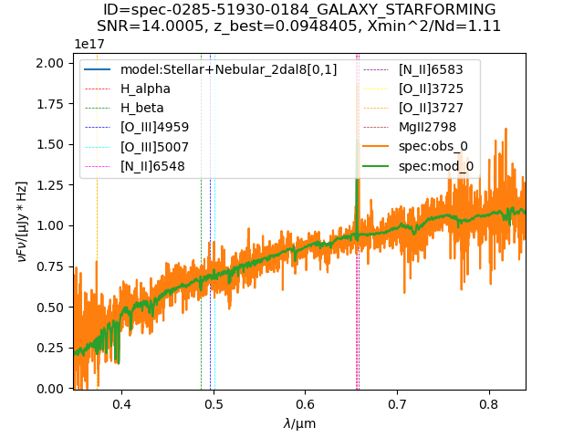
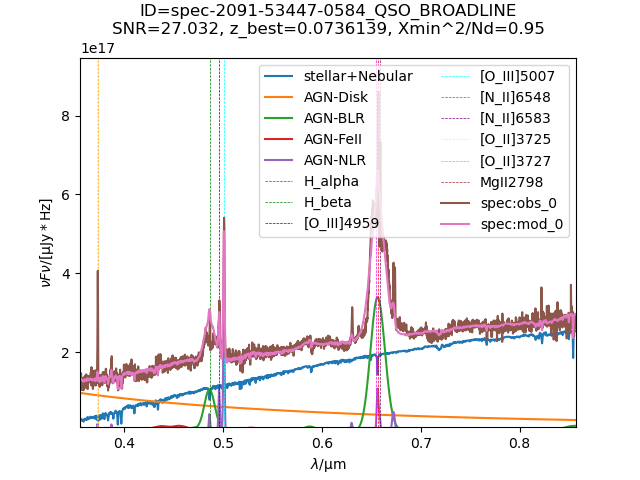
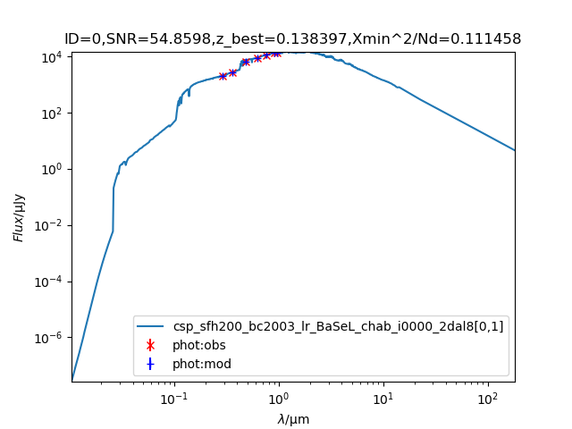
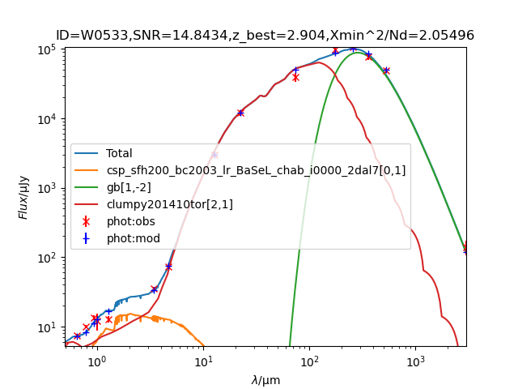
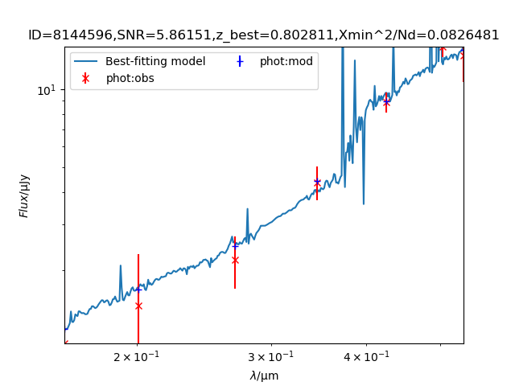
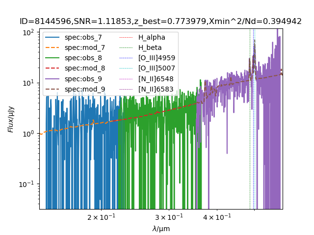
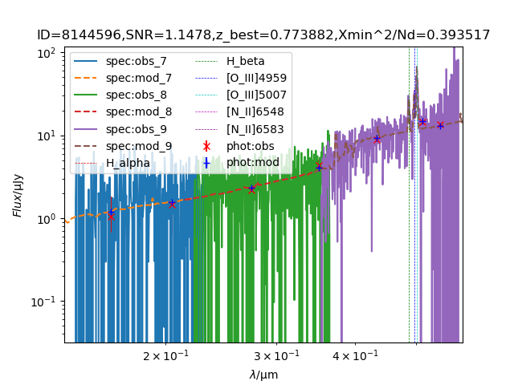
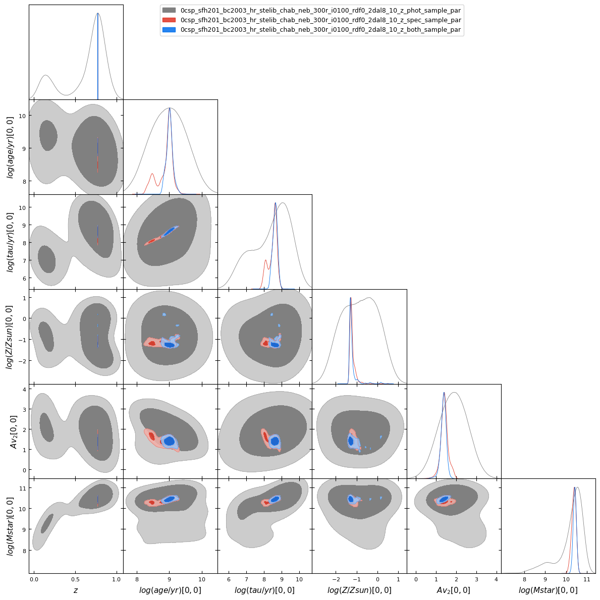
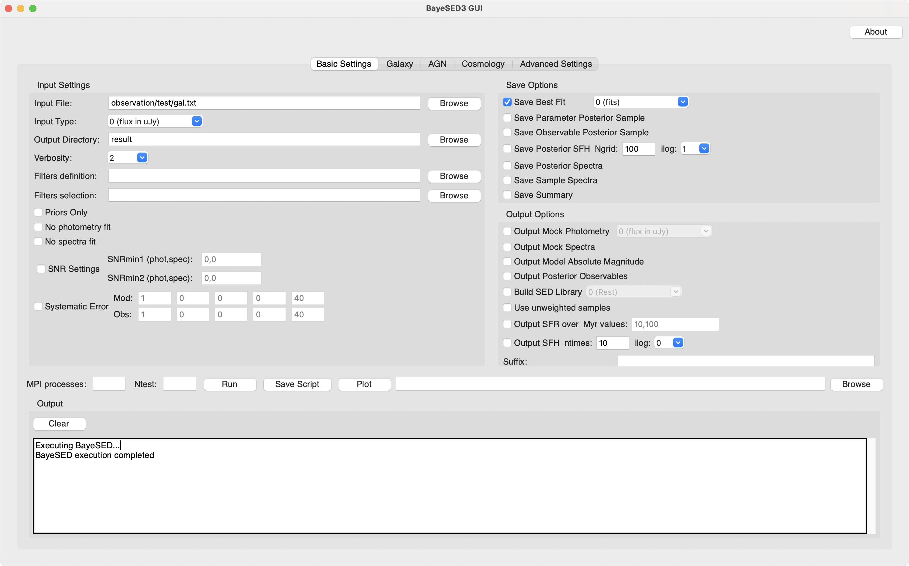

# BayeSED3: A code for Bayesian SED synthesis and analysis of galaxies and AGNs

<p align="center">
  
  <br>
  <em>"With four parameters I can fit an elephant, and with five I can make him wiggle his trunk."</em>
  <br>
  <small>- Attributed to John von Neumann</small>
</p>

BayeSED3 is a general and sophisticated tool for the full Bayesian interpretation of spectral energy distributions (SEDs) of galaxies and AGNs. It performs Bayesian parameter estimation using posteriori probability distributions (PDFs) and Bayesian SED model comparison using Bayesian evidence. BayeSED3 supports various built-in SED models and can emulate other SED models using machine learning techniques.

## Key Features

- **Explore the [BayeSED3-AI Assistant 🚀](https://udify.app/chat/Gmni8M7sHDKWG67F) for interactive help and guidance!**
- Multi-component SED synthesis and analysis of galaxies and AGNs
- Flexible stellar population synthesis modeling
- Flexible dust attenuation and emission modeling
- Flexible stellar and gas kinematics modeling
- Non-parametric and parametric star formation history options
- Comprehensive AGN component modeling (Accretion disk, BLR, NLR, Torus)
- Intergalactic medium (IGM) absorption modeling
- Handling of both photometric and spectroscopic data
- Bayesian parameter estimation and model comparison
- Machine learning techniques for SED model emulation
- Parallel processing support for improved performance
- User-friendly CLI, Python script and GUI interfaces

## Installation Instructions

1. Clone the repository:
   ```
   git clone https://github.com/hanyk/BayeSED3.git
   ```

2. Install OpenMPI:
   ```
   cd BayeSED3
   wget https://download.open-mpi.org/release/open-mpi/v4.1/openmpi-4.1.6.tar.gz
   tar xzvf openmpi-4.1.6.tar.gz
   cd openmpi-4.1.6
   ./configure --prefix=$PWD/../openmpi
   make
   make install
   ```

3. Install Python dependencies:
   ```
   pip install -r requirements.txt
   ```

4. Install HDF5 utilities (optional):
   - Ubuntu/Debian: `sudo apt-get install h5utils`
   - Fedora: `sudo dnf install hdf5-tools`
   - macOS (with Homebrew): `brew install h5utils`

5. Install tkinter (for GUI):
   - Ubuntu/Debian: `sudo apt-get install python3-tk`
   - Fedora: `sudo dnf install python3-tkinter`
   - macOS (with Homebrew): `brew install python-tk`

## Usage examples

1. SDSS spectroscopic SED analysis
   ```
   python run_test.py gal plot
   python run_test.py qso plot
   ```



2. photometric SED analysis
   ```
   python run_test.py test1 plot
   python run_test.py test2 plot
   ```



3. mock CSST photometric and/or spectroscopic SED analysis
   ```
   python run_test.py test3 phot plot
   python run_test.py test3 spec plot
   python run_test.py test3 both plot
   ```





4. [ A new approach to constraining properties of AGN host galaxies by combining image and SED decomposition](https://ui.adsabs.harvard.edu/abs/2024arXiv241005857Y/abstract)

jupyter-notebook [observation/agn_host_decomp/demo.ipynb](observation/agn_host_decomp/demo.ipynb)

### Graphical User Interface (GUI)

Launch the GUI:
```
python bayesed_gui.py
```
The GUI provides an intuitive way to set up complex SED analysis scenarios with meaningful defaults.



## File Descriptions

- `bayesed.py`: Main interface class for BayeSED3
- `bayesed_gui.py`: Graphical User Interface for BayeSED3
- `run_test.py`: Script to run BayeSED3 examples
- `requirements.txt`: List of Python dependencies
- `observation/test/`: Contains test data and configuration files
- `bin/`: Contains BayeSED3 executables for different platforms
- `nets/`: Contains [Fast Artificial Neural Network (FANN)](https://github.com/libfann/fann) and [Approximate K-Nearest Neighbors (AKNN)](http://www.cs.umd.edu/~mount/ANN/) models for SED emulation
- `data/`: other data files used by BayeSED3

## System Compatibility

- Linux: x86_64 architecture
- macOS: x86_64 architecture (ARM supported via Rosetta 2)
- Windows: Supported through Windows Subsystem for Linux (WSL)

## License

This project is licensed under the MIT License. See the [LICENSE](LICENSE) file for details.

## Contributions

Issues and pull requests are welcome. Please make sure to update tests before submitting a pull request.

## Citation

The further development of BayeSED needs your support. If BayeSED has been of benefit to you, either directly or indirectly, please consider citing our papers:
- Han, Y., & Han, Z. 2012, ApJ, 749, 123
- Han, Y., & Han, Z. 2014, ApJS, 215, 2
- Han, Y., & Han, Z. 2019, ApJS, 240, 3
- Han, Y., Fan, L., Zheng, X. Z., Bai, J.-M., & Han, Z. 2023, ApJS, 269, 39
- Han, Y., et al. 2024a, in prep.

## More Information

For more information about [MultiNest](https://github.com/farhanferoz/MultiNest), please refer to the [README_multinest.txt](README_multinest.txt) file.

## Star History

[](https://star-history.com/#hanyk/BayeSED3&Date)
