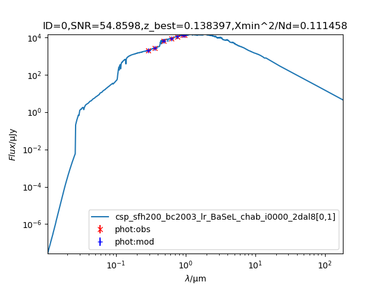
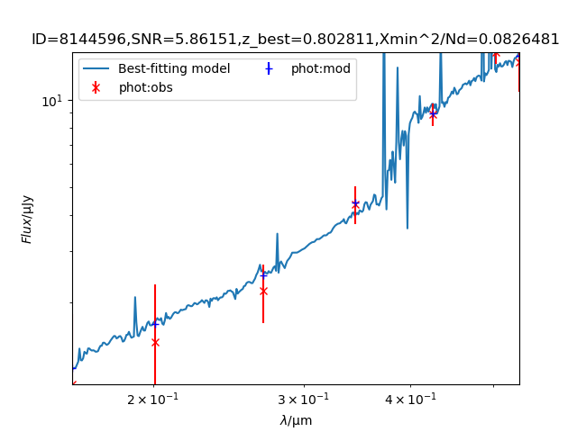

# BayeSED3: A code for Bayesian SED synthesis and analysis of galaxies and AGNs 

<p align="center">
  
  <br>
  <em>"With four parameters I can fit an elephant, and with five I can make him wiggle his trunk."</em>
  <br>
  <small>- Attributed to John von Neumann</small>
</p>

## Table of Contents

- [BayeSED3: A code for Bayesian SED synthesis and analysis of galaxies and AGNs](#bayesed3-a-code-for-bayesian-sed-synthesis-and-analysis-of-galaxies-and-agns)
  - [Table of Contents](#table-of-contents)
  - [Overview](#overview)
    - [Key Features](#key-features)
  - [Installation](#installation)
  - [System Compatibility](#system-compatibility)
  - [Input Data Format](#input-data-format)
    - [File Structure Overview](#file-structure-overview)
    - [Header Format](#header-format)
    - [Data Column Organization](#data-column-organization)
      - [Part 1: Basic Information](#part-1-basic-information)
      - [Part 2: Photometric Data](#part-2-photometric-data)
      - [Part 3: Additional Information](#part-3-additional-information)
      - [Part 4: Spectroscopic Data](#part-4-spectroscopic-data)
  - [Detailed Input/Output Specifications](#detailed-inputoutput-specifications)
    - [Input Requirements](#input-requirements)
    - [Output Files](#output-files)
  - [Running BayeSED3](#running-bayesed3)
    - [Command Line Interface](#command-line-interface)
    - [Essential Options](#essential-options)
    - [Model Selection Options](#model-selection-options)
      - [Stellar Population Models](#stellar-population-models)
      - [Dust Models](#dust-models)
    - [AGN Component Options](#agn-component-options)
    - [Emission Line Component Options](#emission-line-component-options)
    - [Machine Learning Options](#machine-learning-options)
    - [Output Control Options](#output-control-options)
    - [Analysis Options](#analysis-options)
    - [System Settings](#system-settings)
    - [MultiNest Settings](#multinest-settings)
    - [Data Quality Control](#data-quality-control)
    - [Analysis Control](#analysis-control)
    - [Prior Settings](#prior-settings)
    - [Additional Options](#additional-options)
    - [Python Interface](#python-interface)
      - [Quick Start](#quick-start)
      - [Common Use Cases](#common-use-cases)
      - [Working with Data](#working-with-data)
      - [Data Classes for Observation Management](#data-classes-for-observation-management)
      - [Model Configuration](#model-configuration)
      - [Filter Selection and Management](#filter-selection-and-management)
      - [Advanced Configuration](#advanced-configuration)
      - [Execution and Results](#execution-and-results)
      - [Advanced: Low-Level Interface](#advanced-low-level-interface)
    - [Low-Level Parameter Reference](#low-level-parameter-reference)
    - [Low-Level Configuration Examples](#low-level-configuration-examples)
      - [Extending Models Created with Builder Methods](#extending-models-created-with-builder-methods)
    - [GUI Interface](#gui-interface)
  - [Output Files](#output-files-1)
  - [Examples](#examples)
    - [1. SDSS Spectroscopic SED Analysis](#1-sdss-spectroscopic-sed-analysis)
    - [2. Photometric SED Analysis](#2-photometric-sed-analysis)
    - [3. Mock CSST Analysis](#3-mock-csst-analysis)
    - [4. AGN Host Galaxy Decomposition](#4-agn-host-galaxy-decomposition)
    - [GUI Interface](#gui-interface-1)
    - [Key Configuration Notes](#key-configuration-notes)
  - [Best Practices](#best-practices)
    - [Python Interface Best Practices](#python-interface-best-practices)
      - [Use Class-Based Instances for Model Components](#use-class-based-instances-for-model-components)
      - [Let the Interface Auto-Assign igroup and id](#let-the-interface-auto-assign-igroup-and-id)
      - [Use Method Chaining for Fluent Code](#use-method-chaining-for-fluent-code)
      - [Validate Before Running](#validate-before-running)
      - [Use Appropriate MPI Mode](#use-appropriate-mpi-mode)
      - [Start Simple, Extend Gradually](#start-simple-extend-gradually)
      - [Use Class-Based Instance Management for Complex Configurations](#use-class-based-instance-management-for-complex-configurations)
      - [Use Numpy Arrays for Performance](#use-numpy-arrays-for-performance)
      - [Save Configurations for Reproducibility](#save-configurations-for-reproducibility)
      - [Test with Small Samples First](#test-with-small-samples-first)
    - [General Best Practices](#general-best-practices)
  - [Error Handling and Troubleshooting](#error-handling-and-troubleshooting)
    - [Common Issues](#common-issues)
    - [Diagnostic Tools](#diagnostic-tools)
  - [References](#references)
  - [File Descriptions](#file-descriptions)
  - [Citation](#citation)
  - [More Information](#more-information)
  - [License](#license)
  - [Contributions](#contributions)

## Overview

BayeSED3 is a general and sophisticated tool for the full Bayesian interpretation of spectral energy distributions (SEDs) of galaxies and AGNs. It performs:

- Bayesian parameter estimation using posteriori probability distributions (PDFs)
- Bayesian SED model comparison using Bayesian evidence
- Support for various built-in SED models and machine learning model emulation
- Multi-component SED synthesis and analysis

### Key Features

- Multi-component SED synthesis and analysis of galaxies and AGNs
- Flexible stellar population synthesis modeling
- Flexible dust attenuation and emission modeling
- Flexible stellar and gas kinematics modeling
- Non-parametric and parametric star formation history options
- Comprehensive AGN component modeling (Accretion disk, BLR, NLR, Torus)
- Intergalactic medium (IGM) absorption modeling
- Handling of both photometric and spectroscopic data
- Bayesian parameter estimation and model comparison
- Machine learning techniques for SED model emulation
- Parallel processing support for improved performance
- User-friendly CLI, Python script and GUI interfaces
- **Explore the [BayeSED3-AI Assistant 🚀](https://udify.app/chat/Gmni8M7sHDKWG67F) for interactive help and guidance!**

## Installation

**Platform support:**
- Linux x86_64
- macOS (x86_64 and ARM64 via Rosetta 2)
- Windows (via WSL - uses Linux binaries)

### Prerequisites

1. **Clone the repository:**
   ```bash
   git clone https://github.com/hanyk/BayeSED3.git
   cd BayeSED3
   ```

### Option 1: Pip Installation (Easier Uninstall) ⭐ Recommended

**Pip installation is simpler for uninstalling** - it only removes bayesed3, not its dependencies.

**Installation:**
```bash
# Install OpenMPI first (required)
conda install openmpi=4.1.6
# Or via system: brew install openmpi (macOS) or apt-get install openmpi-bin (Linux)

# Install BayeSED3
pip install .          # Regular install (for production use)
pip install -e .      # Editable install (for development - changes immediately visible)
```

**Uninstall:**
```bash
pip uninstall bayesed3
# Dependencies (OpenMPI, matplotlib, etc.) stay installed
```

**Benefits:**
- ✅ Cleaner uninstall (only removes bayesed3)
- ✅ Faster development cycle
- ✅ Works with virtual environments
- ⚠️ Requires OpenMPI to be installed separately

**Note:** 
- **Regular install** (`pip install .`): Copies files to site-packages. Use for production.
- **Editable install** (`pip install -e .`): Links to source directory. Changes are immediately visible. Use for development.
- BayeSED3 automatically detects OpenMPI from conda, system, or local installation. If none is found, it will prompt you to install OpenMPI via conda (if available) or ask for permission to auto-compile it.

### Option 2: Conda Installation (Automatic Dependencies)

**Conda automatically handles all dependencies including OpenMPI.** Note: BayeSED3 is not yet available on conda-forge. You must build it locally.

**Installation:**
```bash
# Build conda package from source (run from repository root)
conda build conda/

# Install the locally built package
conda install --use-local bayesed3
```

**Uninstall:**
```bash
# Remove BayeSED3 (also removes dependencies like OpenMPI, matplotlib, etc.)
conda remove bayesed3

# Optional: Clean package cache
conda clean --packages -y

# Optional: Clean build cache (if you built it locally)
conda build purge
```

**Benefits:**
- ✅ Automatic dependency management (OpenMPI, HDF5, Python packages)
- ✅ Works from any directory
- ⚠️ Requires local build first (not available on conda-forge yet)
- ⚠️ Uninstall removes dependencies: `conda remove bayesed3` also removes OpenMPI, matplotlib, etc.

**Note:** BayeSED3 will be available on conda-forge in the future. See `conda/CONDA_FORGE_SUBMISSION.md` for submission status.

### Manual Installation (Advanced)

For manual installation from source:

1. Clone the repository:
   ```
   git clone https://github.com/hanyk/BayeSED3.git
   ```

2. **Install OpenMPI 4.1.6** (REQUIRED):
   
   **Via conda (recommended):**
   ```bash
   conda install -c conda-forge openmpi=4.1.6
   ```
   
   **Via system package manager:**
   - Ubuntu/Debian: `sudo apt-get install openmpi-bin openmpi-common libopenmpi-dev`
   - Fedora: `sudo dnf install openmpi openmpi-devel`
   - macOS (Homebrew): `brew install openmpi`
   
   **Or compile from source:**
   ```bash
   cd BayeSED3
   wget https://download.open-mpi.org/release/open-mpi/v4.1/openmpi-4.1.6.tar.gz
   tar xzvf openmpi-4.1.6.tar.gz
   cd openmpi-4.1.6
   ./configure --prefix=$PWD/../openmpi
   make
   make install
   ```

3. Install Python dependencies:
   ```
   pip install -r requirements.txt
   ```

4. Install HDF5 utilities (optional):
   - Ubuntu/Debian: `sudo apt-get install h5utils`
   - Fedora: `sudo dnf install hdf5-tools`
   - macOS (with Homebrew): `brew install h5utils`

5. Install tkinter (for GUI):
   - Ubuntu/Debian: `sudo apt-get install python3-tk`
   - Fedora: `sudo dnf install python3-tkinter`
   - macOS (with Homebrew): `brew install python-tk`


## Input Data Format

### File Structure Overview
The input data file consists of a header line followed by data lines. Each data line contains four distinct parts:

1. Basic Information
2. Photometric Data
3. Additional Information
4. Spectroscopic Data (if present)

### Header Format
```
# dataset_name num_photometric_bands num_additional_columns num_spectroscopic_bands
```
Example(observation/test1/test_inoise1.txt):
```
# test_inoise1 54 490 3
```
Where:
- First number (54): Number of photometric band pairs in Part 2
- Second number (490): Number of additional columns in Part 3
- Third number (3): Number of spectroscopic bands in Part 4

### Data Column Organization

#### Part 1: Basic Information
```
ID              # Object identifier
z_min           # Minimum redshift
z_max           # Maximum redshift
d               # Distance parameter
E(B-V)          # Extinction parameter
```

#### Part 2: Photometric Data
Pairs of magnitude and error values in AB system:
```
mAB(u)          # Magnitude in u band
mAB_err(u)      # Error in u band magnitude
mAB(B)          # Magnitude in B band
mAB_err(B)      # Error in B band magnitude
...             # Additional band pairs
```

#### Part 3: Additional Information
```
# Various additional columns including:
f[0,1]_{True}                
sys_err0_{True}              
sys_err1_{True}              
m_cut[C0411]_{True}          
m_cut[C1411]_{True}          
logphi1_y1[C3902]_{True}     
...                          
```

#### Part 4: Spectroscopic Data
First, number of points per band:
```
Nw_CSST_GU      # Number of points for GU band
Nw_CSST_GV      # Number of points for GV band
Nw_CSST_GI      # Number of points for GI band
```

Then, for each spectral point:
```
w_CSST_GU0      # Wavelength (microns)
f_CSST_GU0      # Flux
e_CSST_GU0      # Error in flux
s_CSST_GU0      # wavelength dispersion
```


## Detailed Input/Output Specifications

### Input Requirements

1. Input Data:
   
   a. Multi-band Photometric Data:
   - Format options:
     * Flux measurements in μJy (input_type=0)
     * Magnitudes in AB system (input_type=1)
   - Required columns:
     * Flux/Magnitude
     * Error measurements
   
   b. Multi-band Spectroscopic Data:
   - Required columns:
     * Wavelength (in μm)
     * Flux (in μJy)
     * Flux error (in μJy)
     * Wavelength dispersion (in μm)

2. Filter Definition File:
   - example: `observation/test1/filters_COSMOS_CSST_Euclid_LSST_WFIRST.txt`
   - Contains:
     * Wavelength coverage
     * Response functions

3. Filter Selection File:
   - example: `observation/test1/filters_CSST_seleted.txt`
   - Purpose: Specify which filters to use in the analysis
   - Format: List of filter IDs and usage flags

4. Model Component Specifications:
     * Stellar population synthesis (SSP)
     * Star formation history (SFH)
     * Dust attenuation law (DAL)
     * AGN components
     * Dust emission
     * Emission lines

5. Parameter Prior Distributions:
   - File format: `.iprior` files
   - Auto-generated templates available
   - Specifies:
     * Parameter ranges
     * Prior types
     * Sampling configurations

### Output Files

1. Global Results File (*.hdf5):
   - Contains for all sources:
     * Model parameter estimates
     * Error estimates
     * Bayesian evidence values
     * Fit statistics
   - Format: HDF5 hierarchical data format
   - Advantages:
     * Efficient storage
     * Fast access
     * Hierarchical organization

2. Individual Source Best-fit Results (*_bestfit.fits):
   - Contains:
     * Best-fit model spectrum
     * Input data points
     * Residuals
     * Component contributions
   - Format: FITS binary table
   - Includes:
     * Wavelength grid
     * Flux values
     * Error estimates

3. Posterior Distribution Samples:
   - Files:
     * *_sample_par.paramnames: Parameter definitions (GetDist format)
     * *_sample_par.txt: Sample values (GetDist format)
   - Format: GetDist compatible
   - Contents:
     * First columns: P_{posterior} (posterior weights) and loglike (log-likelihood)
     * Remaining columns: Parameter samples aligned with paramnames
   - Note: P_{posterior} and loglike are useful for weighted sampling with nested sampling methods


## Running BayeSED3

### Command Line Interface 
```bash
./bayesed [OPTIONS] -i inputfile
```

### Essential Options

- `-i, --input ARG1[,ARGn]`: Input file containing observed photometric SEDs with given unit
  - `0`: Flux in μJy
  - `1`: AB magnitude
  Example: `-i 0,observation/ULTRAVISTA/ULTRAVISTA0.txt`

- `--filters ARG`: Set the file containing filter definitions
  Example: `--filters filter/filters.txt`

- `--filters_selected ARG`: Set all used filters in the observation
  Example: `--filters_selected filter/filters_selected.txt`

- `--outdir ARG`: Output directory for all results
  Example: `--outdir result/`

### Model Selection Options

#### Stellar Population Models
- `-ssp, --ssp ARG1[,ARGn]`: Select a SSP model for the CSP model
  Example: `-ssp igroup,id,ynII,iscalable,k,f_run,Nstep,i0,i1,i2,i3`

- `-sfh, --sfh ARG1[,ARGn]`: Select a SFH for the CSP model
  Types:
  - 0: Instantaneous burst
  - 1: Constant
  - 2: Exponentially declining
  - 3: Exponentially increasing
  - 4: Single burst of length tau
  - 5: Delayed
  - 6: Beta
  - 7: Lognormal
  - 8: Double power-law
  - 9: Nonparametric

#### Dust Models
- `--dal ARG1[,ARGn]`: Set the dust attenuation law
  Laws:
  - 0: SED model with L_dust normalization
  - 1: Starburst (Calzetti+2000)
  - 2: Milky Way (Cardelli+1989)
  - 3: Star-forming (Salim+2018)
  - 4: MW (Allen+76)
  - 5: MW (Fitzpatrick+86)
  - 6: LMC (Fitzpatrick+86)
  - 7: SMC (Fitzpatrick+86)
  - 8: SB (Calzetti2000)
  - 9: Star-forming (Reddy+2015)

- `-gb, --greybody ARG1[,ARGn]`: Grey body spectrum
  Example: `--greybody igroup,id,gb,iscalable,ithick,w_min,w_max,Nw`

- `-bb, --blackbody ARG1[,ARGn]`: Black body spectrum
  Example: `--blackbody igroup,id,bb,iscalable,w_min,w_max,Nw`

### AGN Component Options

- `-bbb, --big_blue_bump ARG1[,ARGn]`: The big blue bump continuum spectrum of AGN
  Example: `-bbb igroup,id,bbb,iscalable,w_min,w_max,Nw`

- `-AGN, --AGN ARG1[,ARGn]`: The qsosed|agnsed|fagnsed|relagn|relqso|agnslim model of AGN
  Example: `-AGN igroup,id,AGN,iscalable,imodel,icloudy,suffix,w_min,w_max,Nw`

### Emission Line Component Options
- `-ls, --lines ARG1[,ARGn]`: Set emission lines from a file
  Example: `-ls igroup_start,id_start,file,iscalable,0.0,R,Nsample,Nkin`

- `-ls1, --lines1 ARG1[,ARGn]`: Set emission lines as one SED model
  Example: `-ls1 igroup,id,name,iscalable,file,R,Nsample,Nkin`

### Machine Learning Options

- `-a, --fann ARG1[,ARGn]`: Select FANN model by name
  Example: `-a igroup,id,name,iscalable`

- `-k, --aknn ARG1[,ARGn]`: Select AKNN model by name
  Example: `-k igroup,id,name,iscalable,k,f_run,eps,iRad,iprep,Nstep,alpha`

- `--rbf ARG1[,ARGn]`: Select RBF model by name
  Example: `-k igroup,id,name,iscalable`

- `--inn ARG1[,ARGn]`: Select INN model by name
  Example: `--inn igroup,id,name,iscalable,f_run,ikey`

### Output Control Options

- `--save_bestfit ARG`: Save best fitting result (0:fits 1:hdf5 2:both)
- `--save_pos_spec`: Save posterior distribution of model spectra
- `--save_sample_par`: Save posterior sample of parameters
- `--save_summary`: Save the summary file
- `--output_mock_photometry ARG`: Output mock photometry with best fit
- `--output_mock_spectra`: Output mock spectra with best fit
- `--save_pos_sfh ARG1[,ARGn]`: Save the posterior distribution of SFH
  Example: `--save_pos_sfh 100,1`
- `--save_sample_obs`: Save posteriori sample of observables
- `--save_sample_spec`: Save the posterior sample of model spectra

### Analysis Options

- `--build_sedlib ARG`: Build a SED library using employed models (0:rest,1:observed)
- `--make_catalog ARG1[,ARGn]`: Make catalog using model SEDs
  Example: `--make_catalog id1,logscale_min1,logscale_max1,id2,logscale_min2,logscale_max2`
- `--output_SFH ARG1[,ARGn]`: Output SFH over past tage year
  Example: `--output_SFH 10,0`
- `--SFR_over ARG1[,ARGn]`: Compute average SFR over past given Myrs
  Example: `--SFR_over 10,100`
- `--output_model_absolute_magnitude`: Output model absolute magnitude of best fit

### System Settings

- `--cosmology ARG1[,ARGn]`: Set cosmological parameters
  Example: `--cosmology 70,0.7,0.3` (default)
- `--IGM ARG1[,ARGn]`: Select IGM attenuation model (0-5)
- `--kin ARG1[,ARGn]`: Set kinematics parameters
  Example: `--kin -1,10,0,0` (default)
- `--gsl_integration_qag ARG1[,ARGn]`: Set GSL integration parameters
  Example: `--gsl_integration_qag 0,0.1,1000` (default)
- `--gsl_multifit_robust ARG1[,ARGn]`: Set robust fitting parameters
  Example: `--gsl_multifit_robust ols,1` (default)

### MultiNest Settings

- `--multinest ARG1[,ARGn]`: Configure MultiNest parameters
  Format: `IS,mmodal,ceff,nlive,efr,tol,updInt,Ztol,seed,fb,resume,outfile,logZero,maxiter,acpt_min`
  Default: `1,0,0,100,0.1,0.5,1000,-1e90,1,0,0,0,-1e90,100000,0.01`
- `--logZero ARG`: Max allowed Nsigma for multinest logZero
  Example: `--logZero 100000` (default)
- `--Ndumper ARG1[,ARGn]`: Set dumper parameters
  Example: `--Ndumper 1,0,-1` (default)

### Data Quality Control
- `--SNRmin1 ARG1[,ARGn]`: Minimal SNR of data (phot,spec) for determining scaling
  Example: `--SNRmin1 0,0` (default)
- `--SNRmin2 ARG1[,ARGn]`: Minimal SNR of data (phot,spec) for likelihood evaluation
  Example: `--SNRmin2 0,0` (default)
- `--sys_err_mod ARG1[,ARGn]`: Prior for fractional systematic error of model
  Example: `--sys_err_mod iprior_type,is_age,min,max,nbin` (default:1,0,0,0,40)
- `--sys_err_obs ARG1[,ARGn]`: Prior for fractional systematic error of observations
  Example: `--sys_err_obs iprior_type,is_age,min,max,nbin` (default:1,0,0,0,40)

### Analysis Control
- `--no_photometry_fit`: Skip fitting photometric data even if present
- `--no_spectra_fit`: Skip fitting spectra data even if present
- `--priors_only`: Test priors by setting loglike for observational data to zero
- `--unweighted_samples`: Use unweighted posterior samples
- `--Ntest ARG`: Number of objects for test run
- `--niteration ARG`: Number of iterations (default: 0)
- `--NfilterPoints ARG`: Number of points per filter (default: 30)
- `--Nsample ARG`: Number of samples for catalog generation and SED library building

### Prior Settings
- `--z ARG1[,ARGn]`: Set prior for redshift z
  Example: `--z iprior_type,is_age,min,max,nbin` (default:1,0,z_min,z_max,100)
- `--np_sfh ARG1[,ARGn]`: Set prior type and parameters for nonparametric SFH
  Example: `--np_sfh 5,0,10,100` (default)
  - Prior types (0-7)
  - Interpolation method (0-3)
  - Number of bins
  - Regularization parameter

### Additional Options

- `-p, --polynomial ARG`: Multiplicative polynomial of order n
- `-t, --template ARG1[,ARGn]`: Use template SED with given name
- `--cloudy ARG1[,ARGn]`: Use SED model from CLOUDY code (v17.02)
- `--sedlib ARG1[,ARGn]`: Use SEDs from a sedlib
- `--LineList ARG1[,ARGn]`: LineList file and type for cloudy model
- `--import ARG1[,ARGn]`: Import command line options from file
- `--export ARG`: Export all options including defaults
- `--check`: Print all inputs and their category
- `--verbose ARG`: Set verbose level

For a complete list of options, run:
```bash
./bayesed --help
```


### Python Interface

The Python interface provides a programmatic way to configure and run BayeSED3 analyses. Start with simple examples and progress to more complex configurations as needed.

#### Quick Start

The simplest way to run an analysis:

```python
from bayesed import BayeSEDInterface, BayeSEDParams

# Initialize interface
bayesed = BayeSEDInterface(mpi_mode='1', np=4)

# Create parameters
params = BayeSEDParams.galaxy(
    input_file='observation/test1/input_catalog.txt',
    outdir='observation/test1/output',
    ssp_model='bc2003_hr_stelib_chab_neb_2000r',
    sfh_type='exponential',
    dal_law='calzetti'
)

# Validate and run
check_result = bayesed.check_config(params)
if check_result['valid']:
    result = bayesed.run(params)
    results = bayesed.load_results('observation/test1/output')
    spectrum = results.get_bestfit_spectrum()
    evidence = results.get_evidence()
```

#### Common Use Cases

**Galaxy Fitting:**

```python
# Simple galaxy fitting
params = BayeSEDParams.galaxy(
    input_file='input.txt',
    outdir='output',
    ssp_model='bc2003_hr_stelib_chab_neb_2000r',
    sfh_type='exponential',
    dal_law='calzetti'
)
bayesed.run(params)
```

**AGN Fitting:**
```python
# AGN with all components (includes galaxy host)
params = BayeSEDParams.agn(
    input_file='input.txt',
    outdir='output',
    ssp_model='bc2003_hr_stelib_chab_neb_2000r',  # Galaxy SSP model
    sfh_type='exponential',  # Galaxy star formation history
    dal_law='calzetti',  # Galaxy dust attenuation law
    agn_components=['dsk', 'blr', 'nlr', 'feii']  # AGN components
)
bayesed.run(params)
```

**Custom Galaxy Model:**
```python
from bayesed.model import SEDModel

# Create galaxy instance and customize
galaxy = SEDModel.create_galaxy(
    ssp_model='bc2003_hr_stelib_chab_neb_2000r',
    sfh_type='exponential',
    dal_law='calzetti'
)
galaxy.add_dust_emission()  # Add dust emission

# Add to parameters
params = BayeSEDParams(input_type=0, input_file='input.txt', outdir='output')
params.add_galaxy(galaxy)
bayesed.run(params)
```

#### Working with Data

**From Data Arrays to Analysis:**

```python
import numpy as np
from bayesed import BayeSEDInterface, BayeSEDParams
from bayesed.data import SEDObservation
from bayesed.model import SEDModel
from bayesed.utils import create_filters_from_svo
import os

# Step 1: Create observation data
obs = SEDObservation(
    ids=[1, 2, 3],
    z_min=[0.1, 0.2, 0.3],
    z_max=[0.2, 0.3, 0.4],
    phot_filters=['SLOAN/SDSS.u', 'SLOAN/SDSS.g', 'SLOAN/SDSS.r'],
    phot_fluxes=np.array([[10.0, 20.0, 30.0], [15.0, 25.0, 35.0], [20.0, 30.0, 40.0]]),
    phot_errors=np.array([[1.0, 2.0, 3.0], [1.5, 2.5, 3.5], [2.0, 3.0, 4.0]]),
    input_type=0  # Flux in μJy
)
obs.validate()

# Step 2: Create input catalog file
os.makedirs('observation/my_analysis', exist_ok=True)
input_file = obs.to_bayesed_input('observation/my_analysis', 'input_catalog')

# Step 3: Download filters (optional)
filter_dir = 'observation/my_analysis/filters'
os.makedirs(filter_dir, exist_ok=True)
create_filters_from_svo(
    svo_filterIDs=['SLOAN/SDSS.u', 'SLOAN/SDSS.g', 'SLOAN/SDSS.r'],
    filters_file=os.path.join(filter_dir, 'filters.txt'),
    filters_selected_file=os.path.join(filter_dir, 'filters_selected.txt')
)

# Step 4: Create model using class-based approach (recommended)
galaxy = SEDModel.create_galaxy(
    ssp_model='bc2003_hr_stelib_chab_neb_2000r',
    sfh_type='exponential',
    dal_law='calzetti'
)

# Step 5: Create parameters and add observation/model
params = BayeSEDParams(
    input_type=0,
    input_file=input_file,
    outdir='observation/my_analysis/output',
    filters=os.path.join(filter_dir, 'filters.txt'),
    filters_selected=os.path.join(filter_dir, 'filters_selected.txt')
)
params.add_galaxy(galaxy)

# Step 6: Run analysis
bayesed = BayeSEDInterface(mpi_mode='auto')
result = bayesed.run(params)
```

```python
import numpy as np
from bayesed import BayeSEDInterface, BayeSEDParams

bayesed = BayeSEDInterface(mpi_mode='auto')

# Create input catalog from arrays
input_file = bayesed.prepare_input_catalog(
    output_path='observation/my_analysis/input_catalog.txt',
    catalog_name='my_analysis',
    ids=[1, 2, 3],
    z_min=[0.1, 0.2, 0.3],
    z_max=[0.2, 0.3, 0.4],
    phot_band_names=['u', 'g', 'r'],
    phot_fluxes=np.array([[10.0, 20.0, 30.0], [15.0, 25.0, 35.0], [20.0, 30.0, 40.0]]),
    phot_errors=np.array([[1.0, 2.0, 3.0], [1.5, 2.5, 3.5], [2.0, 3.0, 4.0]]),
    phot_type='fnu'
)

# Download filters from SVO
filter_files = bayesed.prepare_filters_from_svo(
    svo_filter_ids=['SLOAN/SDSS.u', 'SLOAN/SDSS.g', 'SLOAN/SDSS.r'],
    output_dir='observation/my_analysis/filters'
)

# Create parameters with filters and run
params = BayeSEDParams.galaxy(
    input_file=input_file,
    outdir='observation/my_analysis/output',
    filters=filter_files['filters_file'],
    filters_selected=filter_files['filters_selected_file']
)
bayesed.run(params)
```

**Select Specific Filters:**
```python
# If you want to use only some filters from the downloaded set
result = bayesed.prepare_filters_selected(
    filters_file=filter_files['filters_file'],
    selected_indices=[0, 1],  # Use only first 2 filters (u, g)
    output_selection_file='observation/my_analysis/filters/filters_selected_2band.txt'
)

params = BayeSEDParams.galaxy(
    input_file=input_file,
    outdir='observation/my_analysis/output',
    filters=filter_files['filters_file'],
    filters_selected=result['selection_file']  # Use custom selection
)
```

**Using Data Classes:**

Spectral data accepts arrays in different shapes depending on the number of objects:

```python
# Using SEDObservation (recommended)
from bayesed.data import SEDObservation

# Single object, single band - 1D array (Nw,)
obs1 = SEDObservation(
    ids=[1],
    z_min=[0.1],
    z_max=[0.2],
    spec_band_names=['B'],
    spec_wavelengths=[np.array([4000., 4100., 4200.])],  # List with 1D array
    spec_fluxes=[np.array([10., 12., 11.])],
    spec_errors=[np.array([1., 1.2, 1.1])],
    spec_lsf_sigma=[np.array([0.1, 0.1, 0.1])]
)
input_file1 = obs1.to_bayesed_input('observation/test_spec_1d', 'input_catalog')

# Multiple objects, single band - 2D array (N, Nw)
obs2 = SEDObservation(
    ids=[1, 2],
    z_min=[0.1, 0.2],
    z_max=[0.2, 0.3],
    spec_band_names=['B'],
    spec_wavelengths=[np.array([[4000., 4100.], [4000., 4100.]])],  # List with 2D array
    spec_fluxes=[np.array([[10., 12.], [11., 13.]])],
    spec_errors=[np.array([[1., 1.2], [1.1, 1.3]])],
    spec_lsf_sigma=[np.array([[0.1, 0.1], [0.1, 0.1]])]
)
input_file2 = obs2.to_bayesed_input('observation/test_spec_2d', 'input_catalog')

# Or using prepare_input_catalog()
input_file3 = bayesed.prepare_input_catalog(
    output_path='observation/test_spec/input_catalog.txt',
    catalog_name='test_spec',
    ids=[1, 2],
    z_min=[0.1, 0.2],
    z_max=[0.2, 0.3],
    spec_band_names=['B'],
    spec_wavelengths=[np.array([[4000., 4100.], [4000., 4100.]])],
    spec_fluxes=[np.array([[10., 12.], [11., 13.]])],
    spec_errors=[np.array([[1., 1.2], [1.1, 1.3]])],
    spec_lsf_sigma=[np.array([[0.1, 0.1], [0.1, 0.1]])]
)
```

**Performance Tips:**
- Use numpy arrays when possible for best performance (fast path optimization)
- The interface automatically converts diverse formats to numpy arrays early in processing
- Vectorized numpy operations are used internally for efficient data transformations
- No performance penalty for using convenient formats - conversion happens once at the start

#### Data Classes for Observation Management

The `bayesed.data` module provides high-level classes for handling observation data:

```python
from bayesed.data import SEDObservation, PhotometryObservation, SpectrumObservation
import numpy as np

# Unified observation class (handles both photometry and spectroscopy)
obs = SEDObservation(
    ids=[1, 2, 3],
    z_min=[0.1, 0.2, 0.3],
    z_max=[0.2, 0.3, 0.4],
    phot_filters=['SLOAN/SDSS.u', 'SLOAN/SDSS.g', 'SLOAN/SDSS.r'],
    phot_fluxes=np.array([[10.0, 20.0, 30.0], [15.0, 25.0, 35.0], [20.0, 30.0, 40.0]]),
    phot_errors=np.array([[1.0, 2.0, 3.0], [1.5, 2.5, 3.5], [2.0, 3.0, 4.0]]),
    spec_band_names=['B', 'R'],
    spec_wavelengths=[np.array([[4000., 4100.], [4000., 4100.], [4000., 4100.]]),
                      np.array([[6000., 6100.], [6000., 6100.], [6000., 6100.]])],
    spec_fluxes=[np.array([[10., 12.], [11., 13.], [12., 14.]]),
                 np.array([[20., 22.], [21., 23.], [22., 24.]])],
    spec_errors=[np.array([[1., 1.2], [1.1, 1.3], [1.2, 1.4]]),
                 np.array([[2., 2.2], [2.1, 2.3], [2.2, 2.4]])],
    spec_lsf_sigma=[np.array([[0.1, 0.1], [0.1, 0.1], [0.1, 0.1]]),
                    np.array([[0.1, 0.1], [0.1, 0.1], [0.1, 0.1]])],
    input_type=0  # Flux in μJy
)

# Validate data
obs.validate()

# Convert to BayeSED input file format
input_file = obs.to_bayesed_input('observation/my_analysis', 'input_catalog')

# Convenience classes for single data types
phot_obs = PhotometryObservation(
    ids=[1, 2],
    z_min=[0.1, 0.2],
    z_max=[0.2, 0.3],
    phot_filters=['u', 'g', 'r'],
    phot_fluxes=np.array([[10.0, 20.0, 30.0], [15.0, 25.0, 35.0]]),
    phot_errors=np.array([[1.0, 2.0, 3.0], [1.5, 2.5, 3.5]])
)

spec_obs = SpectrumObservation(
    ids=[1],
    z_min=[0.1],
    z_max=[0.2],
    spec_band_names=['B'],
    spec_wavelengths=[np.array([4000., 4100., 4200.])],
    spec_fluxes=[np.array([10., 12., 11.])],
    spec_errors=[np.array([1., 1.2, 1.1])],
    spec_lsf_sigma=[np.array([0.1, 0.1, 0.1])]
)
```

#### Model Configuration

Configure physical models using `SEDModel`:

```python
from bayesed.model import SEDModel

# Create galaxy instance
galaxy = SEDModel.create_galaxy(
    ssp_model='bc2003_hr_stelib_chab_neb_2000r',
    sfh_type='exponential',
    dal_law='calzetti'
)
galaxy.add_dust_emission()  # Add dust emission

# Create AGN instance
agn = SEDModel.create_agn(agn_components=['dsk', 'blr', 'nlr', 'feii'])
agn.add_torus_fann(name='clumpy201410tor')  # Add torus

# Add to parameters
params = BayeSEDParams(input_type=0, input_file='input.txt', outdir='output')
params.add_galaxy(galaxy)
params.add_agn(agn)
```

**Available Model Options:**

- **SSP Models**: `bc2003_hr_stelib_chab_neb_2000r`, `bc2003_lr_BaSeL_chab`, etc.
- **SFH Types**: `'exponential'`, `'delayed'`, `'beta'`, `'lognormal'`, `'nonparametric'`, etc.
- **Dust Laws**: `'calzetti'`, `'milky_way'`, `'star_forming'`, `'smc'`, `'lmc'`, etc.
- **AGN Components**: `'dsk'` (disk), `'blr'` (broad lines), `'nlr'` (narrow lines), `'feii'` (FeII), `'tor'` (torus)

**Note:** `BayeSEDParams.agn()` includes both galaxy host (SSP, SFH, DAL) and AGN components. You can customize the galaxy parameters:

```python
# Customize galaxy host in AGN fitting
params = BayeSEDParams.agn(
    input_file='input.txt',
    ssp_model='bc2003_lr_BaSeL_chab',  # Custom SSP for galaxy host
    sfh_type='delayed',  # Custom SFH for galaxy host
    dal_law='smc',  # Custom dust law for galaxy host
    agn_components=['dsk', 'blr', 'nlr', 'feii']
)
```

#### Filter Selection and Management

**Download Filters from SVO:**
```python
bayesed = BayeSEDInterface()

# Download filters and create selection file
filter_files = bayesed.prepare_filters_from_svo(
    svo_filter_ids=['SLOAN/SDSS.u', 'SLOAN/SDSS.g', 'SLOAN/SDSS.r', 'SLOAN/SDSS.i', 'SLOAN/SDSS.z'],
    output_dir='observation/filters'
)

# Use with builder methods
params = BayeSEDParams.galaxy(
    input_file='input.txt',
    outdir='output',
    filters=filter_files['filters_file'],
    filters_selected=filter_files['filters_selected_file']
)
```

**Select Specific Filters from Existing File:**
```python
# Create selection file with only specific filters
result = bayesed.prepare_filters_selected(
    filters_file='observation/filters/filters.txt',
    selected_indices=[0, 1, 2],  # Select first 3 filters (u, g, r)
    output_selection_file='observation/filters/filters_selected_3band.txt'
)

# Use the selection file
params = BayeSEDParams.galaxy(
    input_file='input.txt',
    outdir='output',
    filters='observation/filters/filters.txt',
    filters_selected=result['selection_file']
)
```

**Combine Filters from Multiple Files:**
```python
# Combine filters from multiple files and select specific ones
result = bayesed.prepare_filters_selected(
    filters_file=['filters_optical.txt', 'filters_nir.txt'],
    output_filters_file='filters_combined.txt',  # Create new combined file
    output_selection_file='filters_selected.txt',
    selected_indices=[0, 2, 4, 10, 15]  # Select specific filters from combined list
)

# Use combined filters
params = BayeSEDParams.galaxy(
    input_file='input.txt',
    outdir='output',
    filters=result['filters_file'],
    filters_selected=result['selection_file']
)
```

**Using Filters with AGN Fitting:**
```python
# Download filters
filter_files = bayesed.prepare_filters_from_svo(
    svo_filter_ids=['SLOAN/SDSS.u', 'SLOAN/SDSS.g', 'SLOAN/SDSS.r'],
    output_dir='observation/filters'
)

# Use with AGN fitting
params = BayeSEDParams.agn(
    input_file='input.txt',
    outdir='output',
    filters=filter_files['filters_file'],
    filters_selected=filter_files['filters_selected_file'],
    agn_components=['dsk', 'blr']
)
```

#### Advanced Configuration

**Inference Settings:**
```python
params.configure_multinest(nlive=500, tol=0.5, efr=0.1)
```

**MPI Mode:**
```python
# Auto-select optimal mode
bayesed = BayeSEDInterface(mpi_mode='auto')
# Or specify: '1' for complex models, 'n' for large catalogs
```


#### Execution and Results

**Run Analysis:**
```python
bayesed = BayeSEDInterface(mpi_mode='1', np=4)
result = bayesed.run(params)
```

**Load Results:**
```python
results = bayesed.load_results('output')

# Get best-fit spectrum
spectrum = results.get_bestfit_spectrum()

# Get posterior samples (includes weights and log-likelihood for weighted sampling)
posteriors = results.get_posterior_samples()
# Returns dict with:
# - 'paramnames': list of parameter names
# - 'samples': array (N_samples, N_params) - parameter samples aligned with paramnames
# - 'posterior_weights': array (optional) - P_{posterior} weights for nested sampling
# - 'loglike': array (optional) - log-likelihood values

# Access data
paramnames = posteriors['paramnames']
samples = posteriors['samples']  # Shape: (N_samples, N_params)
if 'posterior_weights' in posteriors:
    weights = posteriors['posterior_weights']  # For weighted sampling
if 'loglike' in posteriors:
    loglike = posteriors['loglike']  # Log-likelihood values

# Get evidence
evidence = results.get_evidence()
```

**Working with Multiple Model Configurations:**

When you run the same galaxy sample with different model settings, you get multiple HDF5 files (one per model configuration) in the output directory:

```python
results = bayesed.load_results('output')

# List all available model configurations
configs = results.list_model_configurations()
# Returns dict: {'catalog_model1': 'path/to/file1.hdf5', 'catalog_model2': 'path/to/file2.hdf5', ...}
print(f"Available model configurations: {list(configs.keys())}")

# By default, results uses the first HDF5 file found
# To access a specific model configuration, specify the hdf5_file parameter:
params_table = results.load_hdf5_results(hdf5_file=configs['catalog_model2'])
evidence = results.get_evidence()  # Uses default hdf5_file (first one)

# To work with a specific model configuration, you can:
# 1. List configurations and their file paths
for model_name, hdf5_path in configs.items():
    print(f"Model: {model_name}")
    print(f"  File: {hdf5_path}")
    
# 2. Load results from a specific HDF5 file
params_table_model1 = results.load_hdf5_results(hdf5_file=configs['catalog_model1'])
params_table_model2 = results.load_hdf5_results(hdf5_file=configs['catalog_model2'])

# 3. Compare evidence between models
evidence_model1 = results.get_evidence()  # Default (first file)
# To get evidence from a specific model, you'd need to temporarily change hdf5_file
# or create a new BayeSEDResults instance pointing to that file
```

**What's in `results` when multiple models exist:**

```python
results = bayesed.load_results('output')

# Results object contains:
# - results.catalog_name: Catalog name (auto-detected or specified)
# - results.hdf5_files: List of all HDF5 files found
# - results.hdf5_file: Default HDF5 file (first one found, scoped to catalog_name)
# - results.list_model_configurations(): All model configurations for the catalog
# - results.list_objects(): All object IDs (same across all model configurations)

# All methods use results.hdf5_file by default, but you can override:
# - load_hdf5_results(hdf5_file=...) to load from a specific file
# - get_evidence() uses the default hdf5_file
# - get_bestfit_spectrum() and get_posterior_samples() use object_id to find files
```

**Working with Specific Objects:**
```python
# Load results for a specific object
results = bayesed.load_results('output', object_id='0')

# All methods automatically use the specified object_id
spectrum = results.get_bestfit_spectrum()  # For object '0'
posteriors = results.get_posterior_samples()  # For object '0'
evidence = results.get_evidence(object_id='0')
```


#### Advanced: Low-Level Interface

For advanced users who need direct parameter control or exact CLI replication:

```python
from bayesed import BayeSEDParams
from bayesed.params import SSPParams, SFHParams, DALParams

# Low-level: Direct parameter construction
params = BayeSEDParams(
    input_type=0,
    input_file='input.txt',
    outdir='output',
    ssp=[SSPParams(
        igroup=0,
        id=0,
        name='bc2003_hr_stelib_chab_neb_2000r',
        iscalable=1,
        k=1,
        i1=1
    )],
    sfh=[SFHParams(
        id=0,
        itype_sfh=2,
        itype_ceh=0
    )],
    dal=[DALParams(
        id=0,
        ilaw=8,
        con_eml_tot=2
    )]
)
```

### Low-Level Parameter Reference

For direct parameter construction (advanced users only):

```python
from bayesed import BayeSEDParams
from bayesed.params import SSPParams, SFHParams, DALParams

params = BayeSEDParams(
    input_type=0,
    input_file='input.txt',
    outdir='output',
    ssp=[SSPParams(igroup=0, id=0, name='bc2003_hr_stelib_chab_neb_2000r', iscalable=1)],
    sfh=[SFHParams(id=0, itype_sfh=2)],
    dal=[DALParams(id=0, ilaw=8)]
)
```

**Available Model Options:**

**SSP Models:**
- BC03 (Bruzual & Charlot 2003): `bc2003_hr_stelib_chab_neb_2000r`, `bc2003_lr_BaSeL_chab`, etc.
- Libraries: STELIB, BaSeL
- IMF: Chabrier, Salpeter

**SFH Types:**
- `'instantaneous'`, `'constant'`, `'exponential'`, `'delayed'`, `'beta'`, `'lognormal'`, `'double_powerlaw'`, `'nonparametric'`

**Dust Attenuation Laws:**
- `'calzetti'` (Calzetti2000), `'milky_way'`, `'star_forming'`, `'smc'`, `'lmc'`, etc.

**AGN Components:**
- `'dsk'` (accretion disk), `'blr'` (broad lines), `'nlr'` (narrow lines), `'feii'` (FeII), `'tor'` (torus)

For detailed parameter options, see the [API Reference](#) or use `help(SEDModel.create_galaxy)`.

### Low-Level Configuration Examples

These examples show how to construct configurations using low-level parameter classes directly. Use these when you need exact control over all parameters.

**Example 1: Basic Galaxy Configuration (Low-Level)**
```python
params = BayeSEDParams(
    input_type=0,
    input_file='galaxy.txt',
    ssp=[SSPParams(
        igroup=0, id=0,
        name='bc2003_hr_stelib_chab_neb_2000r',
        iscalable=1, i1=1
    )],
    sfh=[SFHParams(id=0, itype_sfh=2)],  # Exponentially declining
    dal=[DALParams(id=0, ilaw=8)]  # Calzetti2000
)
```

**Example 2: AGN Configuration (Low-Level)**
```python
params = BayeSEDParams(
    input_type=0,
    input_file='agn.txt',
    ssp=[SSPParams(...)],
    big_blue_bump=[BigBlueBumpParams(
        igroup=1, id=1, name='bbb',
        iscalable=1, w_min=0.1, w_max=10, Nw=1000
    )],
    lines1=[
        LineParams(  # Broad Line Region
            igroup=2, id=2, name='BLR',
            iscalable=1, file='lines_BLR.txt',
            R=300, Nkin=3
        ),
        LineParams(  # Narrow Line Region
            igroup=4, id=4, name='NLR',
            iscalable=1, file='lines_NLR.txt',
            R=2000, Nkin=2
        )
    ],
    aknn=[AKNNParams(  # FeII emission
        igroup=3, id=3, name='FeII',
        iscalable=1
    )]
)
```

**Example 3: Complex Multi-component Configuration (Low-Level)**

```python
from bayesed.params import SSPParams, SFHParams, DALParams, GreybodyParams, FANNParams, MultiNestParams

params = BayeSEDParams(
    input_type=0,
    input_file='combined.txt',
    # Stellar population
    ssp=[SSPParams(
        igroup=0, id=0,
        name='bc2003_lr_BaSeL_chab',
        iscalable=1
    )],
    sfh=[SFHParams(id=0, itype_sfh=2)],
    dal=[DALParams(id=0, ilaw=7)],  # SMC extinction
    # Dust emission
    greybody=[GreybodyParams(
        igroup=0, id=1,
        name='gb', iscalable=-2
    )],
    # AGN torus model
    fann=[FANNParams(
        igroup=1, id=2,
        name='clumpy201410tor',
        iscalable=1
    )],
    # MultiNest settings
    multinest=MultiNestParams(
        nlive=400,
        efr=0.1,
        updInt=1000,
        fb=2
    )
)
```

**High-Level Equivalent (Recommended):**
```python
from bayesed.model import SEDModel
from bayesed.params import MultiNestParams

# Create galaxy with dust emission
galaxy = SEDModel.create_galaxy(
    ssp_model='bc2003_lr_BaSeL_chab',
    sfh_type='exponential',
    dal_law='smc'  # SMC extinction
)
galaxy.add_dust_emission()

# Assemble configuration
params = BayeSEDParams(input_type=0, input_file='combined.txt')
params.add_galaxy(galaxy)

# Create AGN with torus
agn = SEDModel.create_agn()
agn.add_torus_fann(name='clumpy201410tor')
params.add_agn(agn)  # Auto-assigns IDs
params.multinest = MultiNestParams(nlive=400, efr=0.1, updInt=1000, fb=2)
```

**Alternative using builder methods:**
```python
params = BayeSEDParams.galaxy('combined.txt', ssp_model='bc2003_lr_BaSeL_chab', dal_law='smc')
# Then add AGN components...
```

#### Extending Models Created with Builder Methods

After creating a model with `BayeSEDParams.galaxy()` or `agn()`, you can extend it in several ways:

**Method 1: Add Additional Components Using `add_galaxy()` and `add_agn()`**

```python
from bayesed.model import SEDModel

# Start with a simple galaxy model
params = BayeSEDParams.galaxy(
    input_file='input.txt',
    ssp_model='bc2003_hr_stelib_chab_neb_2000r',
    sfh_type='exponential',
    dal_law='calzetti'
)

# Add dust emission by creating a new galaxy instance and adding it
# (or modify the existing one by accessing params.greybody directly)
galaxy_with_dust = SEDModel.create_galaxy(
    ssp_model='bc2003_hr_stelib_chab_neb_2000r',
    sfh_type='exponential',
    dal_law='calzetti'
)
galaxy_with_dust.add_dust_emission()
params.add_galaxy(galaxy_with_dust)

# Or add AGN components
agn = SEDModel.create_agn(agn_components=['dsk', 'blr'])
params.add_agn(agn)  # Auto-assigns IDs
```

**Method 2: Access and Modify Parameters Directly**

```python
# Start with builder method
params = BayeSEDParams.galaxy('input.txt', dal_law='calzetti')

# Add dust emission directly to the existing galaxy
from bayesed.params import GreybodyParams
params.greybody.append(GreybodyParams(
    igroup=params.ssp[0].igroup,  # Same igroup as galaxy
    id=params.ssp[0].id + 1,      # Next ID
    name='gb',
    iscalable=-2,
    w_min=1.0,
    w_max=1000.0,
    Nw=200
))

# Or modify existing parameters
params.dal[0].ilaw = 7  # Change dust law from 8 to 7
```

**Method 3: Create New Instances and Extend Before Adding**

```python
from bayesed.model import SEDModel

# Create galaxy instance and extend it before creating params
galaxy = SEDModel.create_galaxy(
    ssp_model='bc2003_hr_stelib_chab_neb_2000r',
    sfh_type='exponential',
    dal_law='calzetti'
)
galaxy.add_dust_emission()  # Add dust emission to instance

# Now create params and add the extended galaxy
params = BayeSEDParams(input_type=0, input_file='input.txt')
params.add_galaxy(galaxy)

# Add AGN with torus
agn = SEDModel.create_agn()
agn.add_torus_fann(name='clumpy201410tor')
params.add_agn(agn)  # Auto-assigns IDs
```

**Method 4: Start with Builder, Then Add More Components**

```python
# Start with AGN builder (includes galaxy + AGN components)
params = BayeSEDParams.agn(
    input_file='input.txt',
    ssp_model='bc2003_hr_stelib_chab_neb_2000r',  # Galaxy host SSP
    sfh_type='exponential',  # Galaxy host SFH
    dal_law='calzetti',  # Galaxy host dust law
    agn_components=['dsk', 'blr']  # Start with disk and BLR
)

# Add more AGN components by creating a new AGN instance
# Note: For adding to existing AGN, create a new instance and add it
agn2 = SEDModel.create_agn(
    agn_components=['nlr', 'feii']  # Add NLR and FeII
)
params.add_agn(agn2)  # Auto-assigns IDs
# Or add torus to existing AGN by accessing params directly
from bayesed.params import FANNParams
params.fann.append(FANNParams(
    igroup=params.big_blue_bump[0].igroup,
    id=params.big_blue_bump[0].id + 3,
    name='clumpy201410tor',
    iscalable=1
))
```

**Recommended Approach:**

For simple extensions, use **Method 3** (create instances, extend them, then add):
- Clean and maintainable
- Uses the same logic as builder methods
- Easy to understand and modify

For quick additions, use **Method 2** (direct parameter access):
- Fastest for simple additions
- Requires knowledge of parameter structure
- Less type-safe

**Important Note:**
- `BayeSEDParams.galaxy()` and `agn()` return `BayeSEDParams` instances, not `GalaxyInstance` or `AGNInstance` objects
- The instances are decomposed into parameter lists (ssp, sfh, dal, etc.) when added via `add_galaxy()`/`add_agn()`
- To extend models created with builder methods:
  1. **Best**: Create new instances, extend them, then add to params (Method 3)
  2. **Quick**: Access and modify parameters directly (Method 2)
  3. **Complex**: Create additional instances and add them (Method 1)
- If you need to modify components before adding, use `SEDModel.create_galaxy()`/`create_agn()` directly instead of builder methods

### GUI Interface
```bash
python bayesed_gui.py
```

## Output Files

1. Best-fit results:
   - `.fits` or `.hdf5` format
   - Contains best-fit parameters and model spectra

2. Parameter samples:
   - Posterior distributions with weights (P_{posterior}) and log-likelihood values
   - Weighted sampling support for nested sampling methods
   - Corner plots
   - Chain statistics

3. Model spectra:
   - Best-fit spectrum
   - Uncertainty ranges
   - Component contributions

4. Diagnostic plots:
   - SED fits
   - Residuals
   - Parameter correlations

## Examples

### 1. SDSS Spectroscopic SED Analysis
```bash
python run_test.py gal plot
python run_test.py qso plot
```

Example output for galaxy fitting:


Example output for QSO fitting:


### 2. Photometric SED Analysis
```bash
python run_test.py test1 plot
python run_test.py test2 plot
```

Example output for mock photometric data:


Example output for W0533 ALMA data:


### 3. Mock CSST Analysis
```bash
python run_test.py test3 phot plot  # Photometric analysis
python run_test.py test3 spec plot  # Spectroscopic analysis
python run_test.py test3 both plot  # Combined analysis
```

Example outputs for CSST mock data:

Photometric analysis:


Spectroscopic analysis:


Combined analysis:


Parameter tree diagram:


### 4. AGN Host Galaxy Decomposition
For a demonstration of AGN host galaxy decomposition using image and SED analysis, see:
```bash
jupyter-notebook observation/agn_host_decomp/demo.ipynb
```

This example shows a new approach to constraining properties of AGN host galaxies by combining image and SED decomposition, as described in [our recent paper](https://ui.adsabs.harvard.edu/abs/2024arXiv241005857Y/abstract).

### GUI Interface

The graphical user interface provides an intuitive way to set up complex SED analysis scenarios:


### Key Configuration Notes

1. MPI Settings:
   - Use `--use-hwthread-cpus` for better performance
   - Platform-specific binaries (linux/mac, x86_64 only)

2. MultiNest Parameters:
   - `nlive`: More points for better accuracy (40-400 typical)
   - `efr`: Sampling efficiency (0.05-0.1 typical)
   - `updInt`: Update interval for output files

3. Model Component IDs:
   - Consistent ID numbering across components
   - Group IDs for component organization
   - Scalable parameters for flexibility

4. File Formats:
   - Input type 0: Flux in μJy
   - Input type 1: AB magnitude
   - FITS/HDF5 output options

## Best Practices

### Python Interface Best Practices

#### Use Class-Based Instances for Model Components

Prefer class-based instances (`SEDModel.GalaxyInstance` and `SEDModel.AGNInstance`) over manual parameter construction. Note that `BayeSEDParams.galaxy()` and `agn()` internally use `SEDModel` methods, ensuring consistency:

```python
from bayesed.model import SEDModel

# Good: Use builder methods (recommended for simple configurations)
# Internally uses SEDModel.create_galaxy() and params.add_galaxy()
params = BayeSEDParams.galaxy('input.txt', sfh_type='exponential', dal_law='calzetti')

# Good: Use class-based instances directly (recommended for complex configurations)
# Same underlying logic as builder methods - both use SEDModel.create_galaxy()
galaxy = SEDModel.create_galaxy(
    ssp_model='bc2003_hr_stelib_chab_neb_2000r', 
    sfh_type='exponential', 
    dal_law='calzetti'
)
galaxy.add_dust_emission()  # Add components to instance
params.add_galaxy(galaxy)

# Avoid: Manual construction (error-prone, bypasses validation)
params.ssp.append(SSPParams(igroup=0, id=0, name='...', ...))
params.sfh.append(SFHParams(id=0, itype_sfh=2, ...))
params.dal.append(DALParams(id=0, ilaw=8, ...))
```

Both `BayeSEDParams.galaxy()` and `SEDModel.create_galaxy()` produce identical results. Choose based on convenience - builder methods for quick setup, class-based instances for complex configurations.

#### Let the Interface Auto-Assign igroup and id

The interface automatically assigns `igroup` and `id` values when using builder methods or class-based instances. Only specify them when you need exact control:

```python
from bayesed.model import SEDModel

# Good: Auto-assignment with builder methods (recommended)
params = BayeSEDParams.galaxy('input.txt')  # Auto-assigns IDs starting from 0

# Good: Auto-assignment with class instances
galaxy = SEDModel.create_galaxy()
params.add_galaxy(galaxy)  # Auto-assigns IDs to avoid conflicts
```

#### Use Method Chaining for Fluent Code

Builder methods and configuration methods support method chaining:

```python
from bayesed.model import SEDModel

# Good: Method chaining with builder methods
params = BayeSEDParams.galaxy('input.txt').configure_multinest(nlive=400)

# Good: Method chaining with class instances
galaxy = SEDModel.create_galaxy().add_dust_emission()
params = BayeSEDParams(input_type=0, input_file='input.txt')
params.add_galaxy(galaxy).configure_multinest(nlive=400)
```

#### Validate Before Running

Always validate your configuration before running:

```python
# Validate configuration
try:
    params.validate(check_files=True)
except BayeSEDValidationError as e:
    print(f"Configuration errors: {e}")
    # Fix errors before running
```

#### Use Appropriate MPI Mode

Choose MPI mode based on your use case:

```python
# Mode 1: Complex models or small samples (default)
bayesed = BayeSEDInterface(mpi_mode='1', np=4)

# Mode n: Large catalogues with simple models
# Note: Requires Ncpu <= Nobj + 1
bayesed = BayeSEDInterface(mpi_mode='n', np=4)
```

#### Start Simple, Extend Gradually

Start with builder methods, then add components incrementally:

```python
from bayesed.model import SEDModel
from bayesed.params import SysErrParams

# Step 1: Start simple
params = BayeSEDParams.galaxy('input.txt')

# Step 2: Add AGN components using SEDModel.create_agn()
agn = SEDModel.create_agn(agn_components=['dsk', 'blr'])
agn.add_disk_bbb()  # Or use add_disk_agn(), add_disk_fann(), add_disk_aknn()
params.add_agn(agn)  # Auto-assigns IDs

# Step 3: Customize advanced parameters
params.configure_multinest(nlive=1000, efr=0.3)
params.sys_err_obs = SysErrParams(iprior_type=3, min=0.01, max=0.1)
```

#### Use Class-Based Instance Management for Complex Configurations

For complex configurations (especially when recreating existing test scripts), use `SEDModel.GalaxyInstance` and `SEDModel.AGNInstance` classes for cleaner, more maintainable code:

```python
# Class-based approach (recommended for complex configurations)
from bayesed.model import SEDModel

# Create galaxy instance with all parameters
galaxy = SEDModel.create_galaxy(
    ssp_model='bc2003_hr_stelib_chab_neb_2000r',
    sfh_type='exponential',
    dal_law='calzetti',
    ssp_i1=1,  # All SSP parameters supported
    sfh_itype_ceh=1  # SFH parameters supported
)
galaxy.add_dust_emission()  # Add dust emission if needed
params.add_galaxy(galaxy)

# Create AGN instance with all components
agn = SEDModel.create_agn(
    agn_components=['bbb', 'blr', 'nlr', 'feii', 'tor']  # All components including torus
)
params.add_agn(agn)  # Auto-assigns IDs

# Or add torus separately (FANN or AKNN)
agn.add_torus_fann(name='clumpy201410tor')  # FANN torus
# Or use AKNN torus:
# agn.add_torus_aknn(name='torus_aknn', k=1, f_run=1)
```

**Benefits of class-based approach:**
- **Cleaner code**: Less verbose than direct parameter construction
- **Better organization**: Related components grouped together
- **Easier to maintain**: Changes to one instance don't affect others
- **Supports all parameters**: All parameters from `run_test.py` are accessible
- **Type safety**: IDE provides better autocomplete and type checking

See `examples/recreate_run_test_with_class_based.py` for complete examples showing how to recreate all `run_test.py` test cases using the class-based interface.

#### Use Numpy Arrays for Performance

When preparing data, use numpy arrays for best performance:

```python
# Good: Numpy arrays (best performance)
import numpy as np
ids = np.array([1, 2, 3])
z_min = np.array([0.1, 0.2, 0.3])
phot_fluxes = np.array([[10.0, 20.0], [15.0, 25.0], [12.0, 22.0]])

# Also works: Lists (convenient, converted internally)
ids = [1, 2, 3]
z_min = [0.1, 0.2, 0.3]
```

#### Save Configurations for Reproducibility


#### Test with Small Samples First

Always test with `Ntest=1` before running full analysis:

```python
# Test run
bayesed = BayeSEDInterface(mpi_mode='1', np=1, Ntest=1)
bayesed.run(params)

# Full run
bayesed = BayeSEDInterface(mpi_mode='1', np=4)
bayesed.run(params)
```

### General Best Practices

1. Data Preparation:
   - Ensure consistent units
   - Include measurement uncertainties
   - Remove problematic data points

2. Model Selection:
   - Start with simple models
   - Add components progressively
   - Use Bayesian evidence for model comparison

3. Parameter Settings:
   - Set appropriate prior ranges
   - Adjust MultiNest parameters for convergence
   - Consider systematic errors

4. Performance Optimization:
   - Use MPI for parallel processing
   - Adjust number of live points
   - Balance accuracy and computation time


## Error Handling and Troubleshooting

### Common Issues

1. Input Data Format Errors:
   - Incorrect number of columns in data files
   - Mismatched filter definitions
   - Invalid unit specifications
   - Solution: Verify data format against examples in `observation/test/`

2. Model Parameter Conflicts:
   - Incompatible component combinations
   - Invalid parameter ranges
   - Solution: Check component dependencies and parameter constraints

3. Convergence Problems:
   - Poor initial parameter estimates
   - Insufficient sampling points
   - Complex model topology
   - Solutions:
     * Increase number of live points (`nlive`)
     * Adjust sampling efficiency (`efr`)
     * Simplify model if possible
     * Check parameter priors

4. Memory Issues:
   - Large spectral datasets
   - Many posterior samples
   - Solutions:
     * Reduce number of spectral points
     * Use selective output options
     * Avoid saving full posterior spectra unless necessary

5. Performance Issues:
   - Slow convergence
   - High computation time
   - Solutions:
     * Use MPI parallelization
     * Optimize MultiNest parameters
     * Consider using model emulators (FANN/AKNN)

### Diagnostic Tools

1. Model Validation:
   - Use `--check` to verify input configuration
   - Enable verbose output for detailed logging
   - Examine MultiNest convergence statistics

2. Output Inspection:
   - Check best-fit results
   - Examine posterior distributions
   - Analyze parameter correlations
   - Review residual patterns

3. Quality Assessment:
   - Monitor systematic errors
   - Check SNR thresholds
   - Verify parameter constraints
   - Evaluate Bayesian evidence

## References

Please cite these papers when using BayeSED:
- Han, Y., & Han, Z. 2012, ApJ, 749, 123
- Han, Y., & Han, Z. 2014, ApJS, 215, 2
- Han, Y., & Han, Z. 2019, ApJS, 240, 3
- Han, Y., Fan, L., Zheng, X. Z., Bai, J.-M., & Han, Z. 2023, ApJS, 269, 39
- Han, Y., et al. 2024a, in prep.

## File Descriptions

- `bayesed.py`: Main interface class for BayeSED3
- `bayesed_gui.py`: Graphical User Interface for BayeSED3
- `run_test.py`: Script to run BayeSED3 examples
- `requirements.txt`: List of Python dependencies
- `observation/test/`: Contains test data and configuration files
- `bin/`: Contains BayeSED3 executables for different platforms
- `nets/`: Contains Fast Artificial Neural Network (FANN) and Approximate K-Nearest Neighbors (AKNN) models for SED emulation
- `data/`: Other data files used by BayeSED3

## Citation

If BayeSED has been beneficial to your research, please consider citing our papers:

- Han, Y., & Han, Z. 2012, ApJ, 749, 123
- Han, Y., & Han, Z. 2014, ApJS, 215, 2
- Han, Y., & Han, Z. 2019, ApJS, 240, 3
- Han, Y., Fan, L., Zheng, X. Z., Bai, J.-M., & Han, Z. 2023, ApJS, 269, 39
- Han, Y., et al. 2024a, in prep.

## More Information

For more information about MultiNest, please refer to the `README_multinest.txt` file.

## License

This project is licensed under the MIT License. See the `LICENSE` file for details.

## Contributions

Issues and pull requests are welcome. Please make sure to update tests before submitting a pull request.
